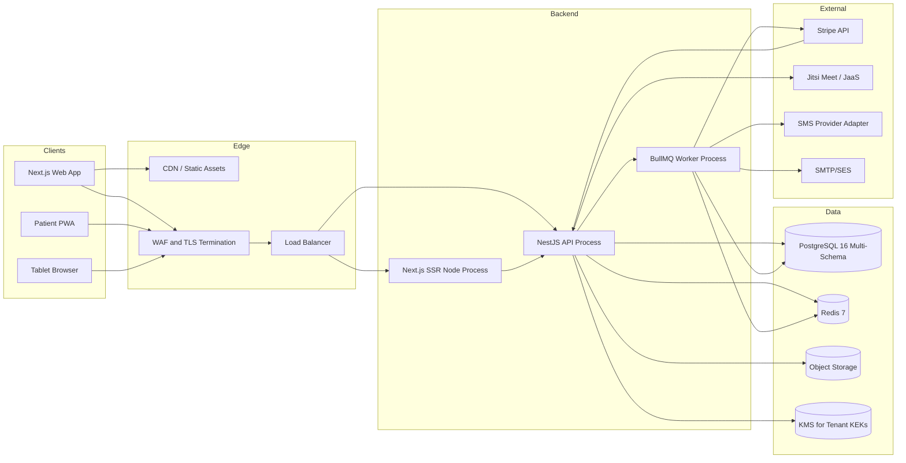
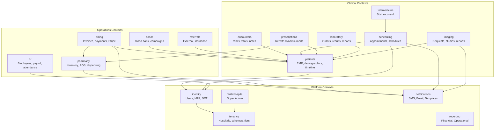
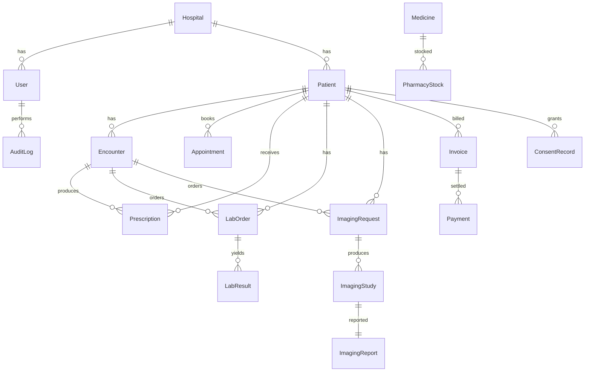

# 0. Agent Action Plan

## 0.1 Product Understanding

### 0.1.1 Core Product Vision

Based on the prompt, the Blitzy platform understands that the new product is **QuantuMed Hospital Management System (QuantuMed HMS)** — a comprehensive, cloud-native, multi-tenant SaaS healthcare platform that consolidates the operational, clinical, financial, and collaborative needs of hospitals, clinics, diagnostic centers, and nursing homes into a single unified solution. The platform must support both single-facility installations and multi-hospital networks, with a deliberate design emphasis on rural and remote healthcare facilities that need access to specialist capabilities through cross-facility collaboration. AI/ML capabilities (patient triage support and workflow optimization) must be embedded into core clinical workflows from day one rather than bolted on later.

**Functional Requirements (Restated With Technical Precision)**

- Patient and Electronic Medical Record (EMR) management with longitudinal clinical history, demographics, encounters, vitals, allergies, chronic conditions, and document attachments
- Appointment and scheduling system with doctor and clinic schedules, resource (room/equipment) management, online self-booking with real-time slot availability, click-to-open patient history popup on calendar entries, and SMS/email reminders
- Clinical workflows for doctors and nurses including consultation notes, care plans, order entry for labs/imaging/medications, prescription creation with dynamic medicine selection, drug interaction checking, and e-signature support
- Pharmacy management with dispensing workflows, real-time inventory with batch and expiry tracking, automated reorder points, supplier management, purchase orders, OTC POS, and tax-aware receipts
- Laboratory management with test catalog, sample collection with barcode tracking, digital result entry with auto-flagging of abnormal results, multi-level verification (technician then pathologist), critical value alerts, and template-based report generation
- Imaging management with imaging requests, study scheduling, radiologist reporting workflow (draft → pending review → reviewed → finalized), and automatic patient SMS notifications on study completion
- Billing and invoicing supporting cash and insurance flows, procedure bundles, payment plans, Stripe integration for online payments and recurring packages, refund workflows, and daily reconciliation
- Multi-facility administration with Super Admin oversight, hospital onboarding automation, package and subscription management, cross-facility reporting, and per-facility branding
- Security and governance including Role-Based Access Control (RBAC) for the 9 base roles (Super Admin, Admin, Doctor, Nurse, Receptionist, Accountant, Pharmacist, Laboratorist, Patient) and the extended roles introduced by feature modules (HR Admin, Lab Technician, Pathologist, Lab Manager, Radiologist, Radiographer, Imaging Technologist, Pharmacy Technician, Referral Coordinator, Donor Coordinator, Telemedicine Provider), plus immutable audit logging
- Cross-facility collaboration with case sharing via manual upload of imaging and documents, radiology collaboration as the pilot specialty, and at least one additional specialty (e.g., pathology) for remote review
- Embedded AI/ML for patient triage (prioritization and risk flags from symptoms, vitals, history) and workflow optimization (queue management, scheduling and workload balancing cues)
- Telemedicine via Jitsi Meet room creation per appointment with session metadata logging
- Teleradiology with secure file upload, patient file archive, and secure links accessible only to authorized roles
- Donor and blood bank management with donor screening, eligibility tracking, blood inventory with expiry monitoring, donation campaigns, and laboratory integration for donor testing
- Human Resources management with employee directory, attendance and leave, payroll with tax calculations, payslip generation, and performance review workflows
- Referral and external provider management with network provider directory, insurance pre-authorization, referral request workflow, and teleconsultation coordination
- Patient self-service gateway with secure messaging, health record viewing, appointment scheduling, online bill pay, and family/dependent account linking
- SMS and email notification system with multi-language template library, variable substitution, bulk messaging, automated triggers (appointment reminders, lab results, payment due, health maintenance), and opt-out/consent logging
- Multi-language UI supporting Arabic (RTL), Amharic, Oromo, Somali, Tigrigna, and English with dynamic language switching and a translation pipeline for adding additional languages
- Financial reporting with profit and loss statements, accounts receivable aging, department profitability, doctor commission calculations, and exportable CSV/PDF reports

**Non-Functional Requirements (Restated With Technical Precision)**

- Security: end-to-end TLS, database encryption at rest, field-level encryption for Protected Health Information (PHI), MFA for ePHI access, immutable audit logs for sensitive actions, OWASP Top 10 hardening, secrets management via Vault or cloud secrets manager
- Compliance: HIPAA-aware design (administrative, physical, and technical safeguards), GDPR-aware design (lawful processing, data export, right to erasure, consent management, 72-hour breach notification readiness)
- Performance: server-side pagination for large tables (appointments, prescriptions, audit logs); patient lookup under 2 seconds; order entry under 3 seconds (per product brief targets)
- Availability: target less than 3% downtime during business hours during MVP; design supports stateless app servers behind load balancers with state in managed PostgreSQL and object storage
- Observability: distributed tracing via OpenTelemetry, metrics via Prometheus, centralized logs via ELK or cloud-native logging
- Scalability: horizontal scaling of stateless services, database read replicas and connection pooling, Redis caching for hot paths, queue-based asynchronous processing for webhooks and notifications
- Accessibility: WCAG 2.1 AA conformance on admin and public website
- Internationalization: full RTL support for Arabic with logical CSS properties; locale-aware date, time, currency, and number formatting

**Implicit Requirements Surfaced From the Healthcare Domain**

- Field-level envelope encryption for the 18 HIPAA-defined PHI identifiers (names, addresses, dates, device identifiers, biometric identifiers, etc.)
- Immutable, append-only audit logs that record actor, tenant, resource, action, before/after snapshots for sensitive actions, and IP/user-agent metadata
- Tenant-scoped audit log export so a hospital can request "every access to my patient data for the last 18 months" without exposing other tenants
- Session timeout and idle lock-out for clinical workstations (HIPAA technical safeguard)
- Prescription print formats compatible with regional pharmacy regulations (legal-size paper, required signature block, controlled-substance indicators)
- Barcode/QR sample tracking for laboratory specimens and pharmacy batches
- ICD-10 diagnosis code fields and CPT/HCPCS procedure code fields on encounters and bills
- Per-facility time zone and currency configuration so a multi-facility tenant in different regions can each operate in their local context
- Mobile-responsive Progressive Web App (PWA) shell because clinicians work on tablets and connectivity is variable in rural sites
- Offline-capable read paths for patient timeline and prescription history (the product brief explicitly flags "intermittent connectivity" as a risk to mitigate)
- Dependent and family account linking for pediatric and elderly care (a patient managing a parent's appointments)
- Granular opt-out and consent logging for SMS, email, and cross-facility data sharing
- One-time forced password rotation for the seeded super-admin account during installation (per the multi-agent prompt's deployment notes)
- Backup encryption per tenant key so that a restored backup is unusable without the originating tenant's key
- Tenant-level disaster recovery SLAs: a Tier-1 enterprise tenant may require a 15-minute RTO, while an SMB tenant accepts 24-hour RTO

**Constraints and Preferences Documented**

- Open-source components and widely adopted providers preferred by default
- Adapter pattern mandated for region-dependent providers (SMS in particular — code MUST NOT couple to Twilio)
- TLS everywhere, database encryption, and activity audit logs are minimum production-grade privacy bars
- Migration/upgrade path required for existing QuantuMed/HMS customers migrating from legacy scripts
- Two installer profiles: containerized docker-compose for single-hospital quick install; Terraform plus Helm charts for production multi-hospital deployment
- Default super-admin login seeded during install with one-time forced password rotation
- All listed demo credentials (`doctor@demo.com / demo123`, `patient@demo.com / demo123`, `hr@demo.com / demo123`, `lab@demo.com / demo123`, `pharmacy@demo.com / demo123`, `imaging@demo.com / demo123`, `reception@demo.com / demo123`, `referral@demo.com / demo123`, `accountant@demo.com / demo123`, `patientgateway@demo.com / demo123`, `notifications@demo.com / demo123`, `telemed@demo.com / demo123`, `donor@demo.com / demo123`) MUST be seeded by the demo seed script for the demo hospital tenant

### 0.1.2 User Instructions Interpretation

**CRITICAL: This sub-section captures all specific directives provided.**

**Technology Stack Directives (Suggested Defaults From the Multi-Agent Prompt)**

- Frontend: React/Next.js
- Backend: Node.js/Express or NestJS
- Database: PostgreSQL
- Cache: Redis
- Containerization: Docker / Kubernetes
- The Solution Architect role is explicitly tasked with proposing isolated DB per hospital OR shared schema with tenant_id with tradeoffs

**Architecture Pattern Directives**

- The prompt suggests starting with the Solution Architect publishing a one-page Architecture Decision Record (ADR) with a recommended stack and tenancy model before any other work begins
- "Parallelize Backend + Frontend work off OpenAPI-first contract" — REST + OpenAPI is the API-first contract
- "Use OpenAPI for APIs; backend must provide swagger for every service"
- "Enforce tests and docs as part of every PR"
- Feature branches → PRs → automated CI → QA acceptance → merge

**Integration Requirements (Verbatim From User)**

- **Payments:** Stripe for hospital packages and one-off payments plus webhook processing
- **Telemedicine:** Jitsi for video conferences (link creation and session logging); optional adapter for third-party telehealth provider
- **SMS:** SMS gateway adapter — User Example: "Twilio or regional SMS gateway"
- **Email:** SMTP/SES adapter for email
- **Auto-email/SMS templates:** with variables and trigger rules
- **Authentication:** JWT + refresh tokens with RBAC for 9 roles

**Deployment Target Specifications**

- **Multi-Hospital Mode:** Superadmin manages hospitals
- **Recommended isolation:** "Isolated DB per hospital (recommended for high compliance/separation). More operational cost but stronger isolation. Provide automation to create DB and config per hospital."
- Automated installer scripts for both Single and Multi modes
- **Single-hospital quick install:** containerized installer (docker-compose)
- **Production multi-hospital:** Terraform + Kubernetes Helm charts
- Default superadmin login seeded during install with one-time forced password rotation

**Compliance Directives (Verbatim From User)**

- "HIPAA/GDPR-aware where applicable"
- "encrypt PHI at rest and in transit, RBAC, audit logs for sensitive actions"
- "Data retention and deletion flows, consent management, and export/import"
- "Provide HIPAA/GDPR checklist and encryption key lifecycle plan"

**Internationalization Directives (Verbatim From User)**

- Mandatory languages: **"Arabic, Amharic, Oromo, Somali, Tigrigna, English and more"**
- "key-based translations, pluralization, RTL support for Arabic"
- "Wire up language fallback and dynamic translation file loading"
- "Accessibility: meet WCAG 2.1 AA on admin and public website"

**Sample API Surface (Preserved Exactly As Given By The User)**

```text
POST /api/auth/login
POST /api/hospitals (superadmin)
GET /api/hospitals/{id}/dashboard
GET /api/doctors / POST /api/doctors
POST /api/patients / GET /api/patients/{id}/timeline
POST /api/appointments / GET /api/appointments?date=...
POST /api/prescriptions (dynamic medicine list)
POST /api/pharmacy/stock / POST /api/pos/create-invoice
POST /api/payments/stripe/webhook
POST /api/telehealth/sessions (creates Jitsi session + logs)
POST /api/notifications/send-sms / POST /api/notifications/send-email
GET /api/reports/financial?from=&to=
```

**Acceptance Criteria for MVP (Preserved Exactly As Given By The User)**

- Role-based logins for nine roles with correct permissions
- Patient CRUD + appointment system + doctor schedule + click-calendar appointment history popup
- Prescription create/edit/download with dynamic medicine selection
- Pharmacy inventory and POS invoice generation with quantity tracking
- Basic financial flows: create payment, invoice, expense, payment history, and basic financial report (date range)
- Multi-hospital onboarding (Super Admin creates a hospital and it spins up logical separation)
- Telehealth via Jitsi link creation and session logging
- Stripe payment for hospital packages and one-off payments + webhook processing
- SMS + Email templating and sending (with example provider)
- UI translations for required languages and language switcher
- CI/CD pipeline that deploys to staging + run smoke tests + deploy to prod on approval
- Test coverage baseline (unit + integration) and automated E2E that covers critical flows
- Documentation: install, deploy, admin use, API reference, backup/restore, and runbook

**Module Route Directives (Preserved Exactly As Given By The User)**

The user explicitly specified URL paths for each module's primary surface: `/doctor/dashboard`, `/doctor/patients`, `/doctor/prescriptions`, `/doctor/appointments`, `/doctor/commissions`, `/patient/dashboard`, `/patient/medical-history`, `/patient/appointments`, `/patient/files`, `/patient/billing`, `/hr/dashboard`, `/hr/employees`, `/hr/attendance`, `/hr/payroll`, `/hr/performance`, `/lab/dashboard`, `/lab/tests`, `/lab/results`, `/lab/reports`, `/lab/quality`, `/pharmacy/dashboard`, `/pharmacy/inventory`, `/pharmacy/dispensing`, `/pharmacy/purchase`, `/pharmacy/pos`, `/imaging`, `/imaging/requests`, `/imaging/studies`, `/imaging/reports`, `/appointments`, `/schedules`, `/book-appointment`, `/resources`, `/appointments/analytics`, `/referrals`, `/referrals/providers`, `/referrals/process`, `/insurance`, `/teleconsultation`, `/payments`, `/payments/gateways`, `/payments/process`, `/payments/refunds`, `/payments/reconciliation`, `/patient-gateway`, `/patient-gateway/messages`, `/patient-gateway/records`, `/patient-gateway/appointments`, `/patient-gateway/billing`, `/notifications`, `/notifications/templates`, `/notifications/bulk`, `/notifications/automation`, `/notifications/gateways`, `/telemedicine`, `/telemedicine/consultation`, `/telemedicine/monitoring`, `/teleradiology`, `/telemedicine/econsult`, `/donor`, `/donor/management`, `/donor/inventory`, `/donor/campaigns`, `/donor/lab`. These paths MUST be preserved verbatim in the Next.js App Router structure.

### 0.1.3 Product Type Classification

**Product Category:** Multi-Tenant Cloud-Native Healthcare SaaS — specifically a Web-First Progressive Web Application (PWA) consisting of:

- A **Next.js 15 web frontend** that serves both public marketing pages (Server-Side Rendered for SEO) and authenticated role-based dashboards (App Router with React Server Components, hybrid SSR/CSR rendering for snappy clinical workflows)
- A **NestJS REST API backend** with an OpenAPI 3.1 specification, designed as a modular monolith with bounded contexts and capable of evolving into independently deployable microservices for hot subsystems (notifications, telemedicine, AI/ML triage)
- A **background worker process** for asynchronous notification delivery, Stripe webhook processing, billing reconciliation, lab result alerting, and reporting job execution
- **Containerized deployment artifacts** (Docker Compose for single-hospital, Helm charts for multi-hospital production on Kubernetes)
- **Infrastructure-as-Code** via Terraform for cloud provisioning (managed PostgreSQL, Redis, object storage, secrets manager, CDN)

**Target Users and Use Cases**

| User Persona                                        | Primary Surface                       | Core Use Cases                                                                                                                                     |
| --------------------------------------------------- | ------------------------------------- | -------------------------------------------------------------------------------------------------------------------------------------------------- |
| Super Admin                                         | `/super-admin/*`                      | Create and configure hospital tenants, manage packages and subscriptions, system-wide reporting                                                    |
| Hospital Admin                                      | `/admin/*`                            | Configure facility, manage staff, departments, branding, schedules, reports                                                                        |
| Doctor                                              | `/doctor/*`                           | Daily appointments, patient records, prescriptions with dynamic medicine selection, lab/imaging orders, telemedicine sessions, commission tracking |
| Nurse                                               | `/nurse/*`                            | Vitals capture, care plans, medication administration, patient timeline                                                                            |
| Receptionist                                        | `/reception/*`                        | Appointment booking and rescheduling, patient registration, queue management                                                                       |
| Accountant                                          | `/accountant/*`                       | Invoicing, payment processing, refunds, daily reconciliation, financial reports                                                                    |
| Pharmacist                                          | `/pharmacy/*`                         | Prescription dispensing, inventory, batch and expiry tracking, supplier management, POS                                                            |
| Laboratorist (Lab Tech / Pathologist / Lab Manager) | `/lab/*`                              | Sample receipt, result entry and verification, lab report generation, QC management                                                                |
| Radiologist / Radiographer / Imaging Technologist   | `/imaging/*`                          | Imaging request triage, study scheduling, equipment status, radiologist reporting                                                                  |
| HR Admin / Department Head                          | `/hr/*`                               | Employee directory, attendance, leave, payroll, performance management                                                                             |
| Referral Coordinator                                | `/referrals/*`                        | External provider network, referral request workflow, insurance pre-authorization                                                                  |
| Donor Coordinator                                   | `/donor/*`                            | Donor registration and screening, blood inventory, donation campaigns                                                                              |
| Telemedicine Provider                               | `/telemedicine/*`                     | Virtual visits via Jitsi, e-consultations, remote patient monitoring                                                                               |
| Patient                                             | `/patient/*` and `/patient-gateway/*` | Self-booking, medical history view, secure messaging, online bill pay, file upload, dependent account management                                   |

**Scale Expectations**

The product brief and multi-agent prompt explicitly target **production-ready** rather than prototype. The MVP must "run daily operations of ≥ 1 mid-size hospital end-to-end" with staff adoption greater than 80% and patient lookup under 2 seconds. The platform must be designed for evolution to thousands of tenants without architectural rewrites, but the MVP target is 1–2 pilot facilities with cross-facility collaboration active for at least 2 facilities (e.g., district hospital + rural clinic).

**Maintenance and Evolution Considerations**

- Architecture must support evolutionary growth from a modular monolith to selectively extracted microservices without rewriting domain code
- Tenancy model must support both schema-per-tenant (default for SMB) and DB-per-tenant (for high-compliance enterprise customers) — the tenant tier is a first-class concept in the data model from day one so it can drive infrastructure provisioning automatically
- The migration framework must support both schema and database migrations across all tenants
- Translation files are externalized so that translators can collaborate without code changes
- SMS and email providers are isolated behind adapter interfaces so regional providers can be plugged in without touching business logic
- OpenAPI specification is the single source of truth for the API contract, generated automatically from NestJS decorators
- A Future Vision is documented explicitly post-MVP: deep interoperability (DICOM, HL7/FHIR), expanded CAD and clinical AI, BI analytics and population health, hardened multi-tenant cloud — these are out of scope for MVP but the architecture must not preclude them

## 0.2 Background Research

### 0.2.1 Technology Research

Web search research conducted includes the following inquiries, with findings synthesized into the architectural decisions documented in subsequent sub-sections.

**Best Practices for Multi-Tenant SaaS in Next.js / NestJS Enterprise Stacks**

Research confirmed that the modern Next.js 15 App Router pattern is the industry-standard frontend foundation for enterprise SaaS, with React Server Components reducing client-bundle size for clinical dashboards that ship large data tables, Server Actions enabling type-safe mutations without manual API client code, and Turbopack as the default development bundler delivering near-instant Hot Module Replacement on monorepo workspaces. Feature-based folder organization (one folder per bounded context with co-located components, hooks, server actions, and tests) is strongly preferred over technology-based organization (separate `components/`, `hooks/`, `pages/` folders) for enterprise codebases because it makes ownership boundaries explicit and supports independent deployment of feature flags.

**Healthcare SaaS Industry Standards and Patterns**

Healthcare SaaS platforms universally adopt the following baseline patterns, validated by research: field-level envelope encryption for PHI columns (encrypt with a per-column Data Encryption Key (DEK), and encrypt the DEK with a tenant-scoped Key Encryption Key (KEK) held in a managed KMS), append-only audit logging with cryptographic hash chaining for tamper-evidence, RBAC with both role-level and resource-level (record-level) permissions, MFA enforcement for any role that accesses PHI, session timeouts under 15 minutes for clinical workstations, and break-glass (emergency override) procedures that automatically escalate audit log severity.

**Popular Frameworks and Libraries**

- **NestJS** is the dominant TypeScript backend framework for enterprise healthcare SaaS — its decorator-driven module system maps cleanly to bounded contexts, its Guards/Interceptors/Pipes pipeline supports the security crosscuts (RBAC, encryption, audit) that healthcare requires, and its `@nestjs/swagger` module auto-generates the OpenAPI 3.1 spec demanded by the multi-agent prompt
- **Prisma 5** is the preferred ORM for PostgreSQL multi-tenant SaaS — its type-safe client generation prevents an entire class of runtime errors, its migration framework supports per-schema migrations needed for schema-per-tenant isolation, and its Prisma Accelerate connection pool addresses the "many tenants on serverless" pattern
- **nestjs-cls** is the de-facto tenant-context propagation library — built on Node.js AsyncLocalStorage, it provides automatic, request-scoped tenant context without requiring every service method to accept a tenant parameter, eliminating an entire class of "leaked tenant context" bugs
- **next-intl** is the modern i18n library for Next.js App Router with first-class RTL support — it integrates with the `[locale]` dynamic segment, uses ICU MessageFormat for pluralization and gender, generates TypeScript types for translation keys (preventing typos), and supports `dir="rtl"` on the html element for Arabic
- **Shadcn UI + Tailwind CSS** is the dominant component pattern for modern healthcare admin UIs — components are copy-pasted into the repo rather than installed as a black-box dependency, allowing per-tenant theming and full accessibility customization
- **TanStack Table** (formerly React Table) is the preferred headless table library for server-side paginated tables, with full support for the appointment, prescription, and audit log tables that demand server-side processing per the multi-agent prompt

**Security Considerations Specific to Healthcare**

Research surfaced the following security requirements that must be designed in from day one:

- TLS 1.2+ everywhere (TLS 1.3 preferred) with HSTS preload
- PostgreSQL Transparent Data Encryption (TDE) or volume-level encryption for at-rest protection
- Column-level encryption for the 18 HIPAA PHI identifiers using authenticated encryption (AES-256-GCM with per-tenant DEKs)
- Bcrypt or Argon2id for password hashing (Argon2id preferred for new systems)
- JWT access tokens with short lifetimes (15 minutes) and refresh tokens with rotation on each use (refresh token rotation defeats stolen-token replay)
- CSRF protection for any cookie-based session paths
- Helmet middleware for OWASP-recommended HTTP security headers (CSP, X-Frame-Options, X-Content-Type-Options, Referrer-Policy, Permissions-Policy)
- Rate limiting via `@nestjs/throttler` to defend against credential stuffing and brute force
- Dependency scanning via Dependabot or Snyk integrated into CI
- Static Application Security Testing (SAST) via CodeQL or Semgrep
- Container image scanning via Trivy

**Performance Optimization Techniques Relevant to the Use Case**

- Server-side cursor-based pagination for tables with potentially unbounded rows (audit logs, appointments) — offset pagination degrades on PostgreSQL when offsets grow large
- Redis caching for hot read paths: doctor availability calendars, medicine catalog, role-permission matrices
- PostgreSQL partial indexes for tenant-scoped queries (`WHERE tenant_id = $1 AND status = 'active'`)
- Connection pooling via PgBouncer or Prisma Accelerate to bound database connections per tenant
- React Server Components for clinical dashboards to reduce client JavaScript and improve Largest Contentful Paint
- Streaming SSR (Next.js Suspense boundaries) for the slow async sections of dashboards (commission totals, AI triage scores) without blocking critical patient identifiers
- Background queue processing via BullMQ on Redis for notifications, reconciliation, report generation, and webhook handling

### 0.2.2 Architecture Pattern Research

**Modular Monolith vs Microservices for Healthcare SaaS**

Research confirms that the modular monolith pattern is the appropriate starting architecture for QuantuMed HMS, with bounded-context modules that can be extracted to microservices once specific scaling pressures emerge. The modular monolith pattern:

- Avoids the operational complexity tax of microservices (service mesh, distributed tracing, eventual consistency) during the MVP phase when business invariants are still being discovered
- Enforces clear domain boundaries via NestJS module imports/exports, making each bounded context independently testable and replaceable
- Permits cross-context communication via in-process domain events that can later be promoted to a message broker (Redis Streams or NATS) without changing the publisher/subscriber code
- Aligns with the multi-agent prompt's "Backend Engineer Agent" responsibilities, which enumerate independent domain services that map naturally to NestJS modules

**Multi-Tenancy Architecture Patterns**

Research identified three canonical patterns and their tradeoffs:

| Pattern                                                 | Isolation                                    | Operational Cost | Compliance Posture            | Recommended For                            |
| ------------------------------------------------------- | -------------------------------------------- | ---------------- | ----------------------------- | ------------------------------------------ |
| Shared DB + tenant_id column + Row-Level Security (RLS) | Logical only                                 | Lowest           | Acceptable with RLS enforced  | Small SMB tenants, MVPs                    |
| Schema-per-tenant in a shared DB                        | Strong (separate namespace per tenant)       | Medium           | Strong                        | Mid-market healthcare SaaS                 |
| Database-per-tenant                                     | Strongest (physical isolation, separate KEK) | Highest          | Maximum (HIPAA gold standard) | Enterprise hospitals, regulatory hot zones |

The **hybrid pattern** is recommended for QuantuMed HMS: **schema-per-tenant as the default** (cost-effective, strong isolation, supports the rural clinic + district hospital pilot model) with **DB-per-tenant for premium tier customers** who require physical isolation, dedicated backup encryption keys, and the ability to host their database in a specific geographic region for data residency compliance. The hybrid model is selected by an `isolation_mode` column on the `hospitals` table at provisioning time, and the application is tenant-aware at the connection-resolution layer so that the same code path serves both tenancy modes.

**Reference Architectures**

Research surfaced two reference architectures applicable to QuantuMed HMS: (a) the AWS Healthcare Industry Lens reference architecture for HIPAA-eligible SaaS workloads on AWS (Multi-AZ RDS PostgreSQL, EKS with Fargate, Secrets Manager, KMS, S3 with bucket policies, CloudWatch with HIPAA-eligible logging) and (b) the OWASP Software Assurance Maturity Model (SAMM) for healthcare SaaS, which prescribes specific security gates at each SDLC stage. Both reference architectures align with the proposed Terraform + Helm deployment topology.

**Common Pitfalls and Anti-Patterns to Avoid**

- Leaking tenant context across requests (the single biggest healthcare SaaS data-breach vector) — mitigated by tenant context middleware via nestjs-cls AsyncLocalStorage and a Guard that hard-fails any query missing tenant context
- Storing PHI in audit log free-text fields (renders the audit log itself PHI) — mitigated by structured, encrypted audit log payloads with redaction at write time
- Using offset-based pagination on potentially unbounded tables — mitigated by cursor-based pagination on `(created_at, id)` composite indexes
- Coupling code to a single SMS provider — mitigated by the adapter pattern mandated by the user
- Synchronous Stripe webhook handling in the request thread — mitigated by writing the webhook payload to a queue and ACKing immediately, with idempotency keys preventing double-processing
- Not encrypting database backups separately from the database — mitigated by per-tenant backup encryption keys held in KMS

### 0.2.3 Dependency and Tool Research

**Latest Stable Versions of Proposed Technologies**

| Technology       | Version Selected                                          | Rationale                                                                                       |
| ---------------- | --------------------------------------------------------- | ----------------------------------------------------------------------------------------------- |
| Next.js          | 15.x                                                      | Latest stable App Router; React 19 support; Turbopack default bundler; Server Actions stable    |
| React            | 19.x                                                      | Bundled with Next.js 15; concurrent features, useFormState/useOptimistic for clinical workflows |
| TypeScript       | 5.4+                                                      | Decorator support stable; const type parameters; required for NestJS strict mode                |
| NestJS           | 10.x (with 11.x evaluation track)                         | Mature DI container; first-class OpenAPI module; @nestjs/throttler; @nestjs/cls integration     |
| Node.js          | 20 LTS                                                    | Long-term support; native test runner availability; performance-first runtime                   |
| PostgreSQL       | 16 (target 17 once cloud-managed availability ubiquitous) | JSON path enhancements; logical replication improvements; partial indexes; RLS                  |
| Redis            | 7.x                                                       | Streams for event sourcing; persistence options; BullMQ compatibility                           |
| Prisma           | 5.x                                                       | Multi-schema support (required for schema-per-tenant); JSON filtering; Driver Adapters          |
| Tailwind CSS     | 3.4                                                       | Logical properties for RTL; container queries; arbitrary variants                               |
| Shadcn UI        | latest                                                    | Accessibility-first; copy-paste components for tenant theming                                   |
| next-intl        | 3.x                                                       | App Router native; ICU MessageFormat; RTL support; type-safe keys                               |
| @jitsi/react-sdk | latest                                                    | Official React wrapper; JaaS support; iframe-based; JWT auth                                    |
| Stripe Node SDK  | 16.x                                                      | Webhook signature helpers; idempotency keys; Connect-ready                                      |
| BullMQ           | 5.x                                                       | Redis-backed jobs; rate limiting; cron support; flow producer for multi-step workflows          |
| OpenTelemetry    | latest stable                                             | Vendor-neutral instrumentation for traces, metrics, logs                                        |
| Helmet           | 7.x                                                       | OWASP HTTP security headers                                                                     |
| nestjs-cls       | 4.x                                                       | AsyncLocalStorage-based tenant context propagation                                              |

**Compatibility Matrix**

- Next.js 15 + React 19 + TypeScript 5.4 — officially supported combination
- NestJS 10 + Node.js 20 LTS + TypeScript 5.4 — officially supported; NestJS CLI scaffolds match
- Prisma 5 + PostgreSQL 16 + Node.js 20 — multi-schema feature requires `previewFeatures = ["multiSchema"]` in schema.prisma
- next-intl 3 + Next.js 15 App Router — first-class App Router support
- @jitsi/react-sdk + React 19 — Jitsi SDK supports React 18+; React 19 compatibility validated via peer dependency
- Stripe 16 + Node 20 — fully compatible
- BullMQ 5 + Redis 7 — officially supported

**Development Tool Recommendations for the Stack**

- **Package Manager:** pnpm 9.x (workspace-native, content-addressable store, deterministic installs, fast monorepo support)
- **Monorepo Orchestrator:** Turborepo (caching task runner; remote cache support; pipeline-based; pnpm-aware)
- **Linting:** ESLint 9 with `eslint-plugin-import`, `eslint-plugin-security`, `@typescript-eslint/strict`
- **Formatting:** Prettier 3.x with shared config in `packages/config-prettier`
- **Commit Hooks:** Husky + lint-staged for pre-commit linting
- **Commit Convention:** Conventional Commits enforced via commitlint
- **Branch Protection:** GitHub Actions required status checks before merge

**Testing Framework Options and Standards**

| Test Type       | Framework Selected                         | Rationale                                                                    |
| --------------- | ------------------------------------------ | ---------------------------------------------------------------------------- |
| Unit (backend)  | Jest with `@nestjs/testing`                | NestJS-native test utilities; mocking; coverage                              |
| Unit (frontend) | Vitest + React Testing Library             | Faster than Jest for React; native ESM; Vite-aligned                         |
| Integration     | Jest + Testcontainers (PostgreSQL + Redis) | Real database integration tests in CI                                        |
| Contract        | Pact                                       | Consumer-driven contracts for external adapters (Stripe, SMS, Jitsi)         |
| E2E             | Playwright                                 | Modern, multi-browser, parallel execution, network mocking, auth state reuse |
| Performance     | k6                                         | Scriptable; CI-friendly; HTTP and WebSocket support                          |
| Security        | Semgrep + Trivy + npm audit                | SAST + container scan + dependency scan                                      |

**CI/CD Pipeline Patterns for the Product Type**

Research validated the following pipeline pattern as the healthcare SaaS standard:

- **PR Pipeline:** Lint → Type Check → Unit Tests → Integration Tests → Build → Container Scan → SAST → PR Comment with test summary
- **Main Branch Pipeline:** All PR steps → Container Build and Push → Database Migration Plan (dry run) → Deploy to Staging → E2E Smoke Tests → Manual Approval Gate → Database Migration (with rollback plan) → Canary Deploy to Production → Health Check → Promote or Rollback
- **Nightly Pipeline:** Full E2E suite → Performance tests against staging → Security scans → Dependency drift report

The pipeline is implemented in GitHub Actions with reusable workflows, with secrets sourced from GitHub Environment secrets and runtime secrets from the cloud secrets manager (AWS Secrets Manager).

## 0.3 Technical Architecture Design

### 0.3.1 Technology Stack Selection

The technology stack is selected to satisfy the user's explicit preferences (React/Next.js, NestJS, PostgreSQL, Redis, Docker/Kubernetes), the implicit healthcare requirements (PHI encryption, audit, RBAC, i18n with RTL), and the operational requirements (multi-tenant, CI/CD, observability).

| Layer                         | Technology                               | Version | Rationale                                                                                                                                                                                                                      |
| ----------------------------- | ---------------------------------------- | ------- | ------------------------------------------------------------------------------------------------------------------------------------------------------------------------------------------------------------------------------ |
| **Frontend Framework**        | Next.js                                  | 15.x    | User-specified preferred default; App Router native i18n via `[locale]` segment; React Server Components reduce bundle size for clinical dashboards; Server Actions enable type-safe mutations; SSR for marketing site and SEO |
| **UI Library**                | React                                    | 19.x    | Bundled with Next.js 15; concurrent rendering; useOptimistic for snappy prescription save UX; useFormState for server-validated forms                                                                                          |
| **Language**                  | TypeScript                               | 5.4+    | Compile-time safety across full stack; decorator support for NestJS; shared types between Web and API via `packages/shared-types`                                                                                              |
| **Styling**                   | Tailwind CSS                             | 3.4     | Logical properties (`ms-4`, `me-4`) work transparently in LTR and RTL; container queries for responsive role-based dashboards; arbitrary variants for medical-form-specific styling                                            |
| **Component Primitives**      | Shadcn UI + Radix UI                     | latest  | Accessibility-first headless components; copy-paste pattern enables per-tenant theming; WCAG 2.1 AA conformance out of the box                                                                                                 |
| **Data Tables**               | TanStack Table                           | 8.x     | Headless, server-side pagination for appointments/prescriptions/audit logs which the multi-agent prompt mandates                                                                                                               |
| **Form Validation**           | Zod + React Hook Form                    | latest  | End-to-end type-safe validation; same Zod schema used in NestJS via `nestjs-zod` for backend validation                                                                                                                        |
| **i18n**                      | next-intl                                | 3.x     | First-class App Router support; ICU MessageFormat for plurals and gender; RTL via `dir="rtl"`; type-safe translation keys                                                                                                      |
| **Video**                     | @jitsi/react-sdk                         | latest  | Official Jitsi React wrapper; supports both self-hosted Jitsi and JaaS (Jitsi as a Service); JWT-based authentication; iframe embedding                                                                                        |
| **Backend Framework**         | NestJS                                   | 10.x    | User-specified preferred default; modular DI architecture maps to bounded contexts; Guards/Interceptors/Pipes pipeline supports the security crosscuts (RBAC, encryption, audit); `@nestjs/swagger` auto-generates OpenAPI 3.1 |
| **Runtime**                   | Node.js                                  | 20 LTS  | Long-term support window; native test runner; performance-first event loop; ESM stable                                                                                                                                         |
| **ORM**                       | Prisma                                   | 5.x     | Type-safe client generation; multi-schema support for schema-per-tenant; migration framework; PostgreSQL-first                                                                                                                 |
| **Database**                  | PostgreSQL                               | 16      | User-specified preferred default; multi-schema support for tenant isolation; Row-Level Security; JSON path; partial indexes; logical replication for read scaling                                                              |
| **Cache and Queues**          | Redis                                    | 7.x     | User-specified preferred default; BullMQ for background jobs; Redis Streams for inter-context events; pub/sub for WebSocket broadcasts                                                                                         |
| **Background Jobs**           | BullMQ                                   | 5.x     | Redis-backed; cron support; rate limiting per queue; flow producer for multi-step workflows (Stripe webhook → invoice update → notification)                                                                                   |
| **Authentication**            | @nestjs/passport + Passport JWT + bcrypt | latest  | Industry-standard JWT bearer with refresh token rotation; user-specified pattern                                                                                                                                               |
| **Tenant Context**            | nestjs-cls                               | 4.x     | AsyncLocalStorage-based; propagates tenant context through every async hop including Prisma middleware                                                                                                                         |
| **Payments**                  | Stripe Node SDK                          | 16.x    | User-specified; webhook signature verification; idempotency keys; Connect-ready                                                                                                                                                |
| **Email**                     | Nodemailer with SMTP and SES adapters    | latest  | Adapter pattern decouples from provider; SMTP for local/dev, SES for AWS production                                                                                                                                            |
| **SMS**                       | Adapter interface with Twilio default    | latest  | User-specified adapter pattern; Twilio default with stubs for regional providers                                                                                                                                               |
| **API Documentation**         | @nestjs/swagger                          | latest  | Auto-generates OpenAPI 3.1 spec from decorators; serves Swagger UI at `/api/docs`                                                                                                                                              |
| **HTTP Security**             | Helmet                                   | 7.x     | OWASP HTTP security headers (CSP, HSTS, X-Frame-Options, X-Content-Type-Options)                                                                                                                                               |
| **Rate Limiting**             | @nestjs/throttler                        | latest  | Tenant-aware rate limiting; defends against credential stuffing                                                                                                                                                                |
| **Observability**             | OpenTelemetry + Prometheus + Pino        | latest  | User-specified; distributed tracing, metrics, structured JSON logs                                                                                                                                                             |
| **Container Runtime**         | Docker                                   | 24+     | User-specified; multi-stage builds; distroless base images                                                                                                                                                                     |
| **Orchestrator**              | Kubernetes via Helm                      | latest  | User-specified; Helm charts for production multi-hospital; raw manifests for staging                                                                                                                                           |
| **IaC**                       | Terraform                                | 1.7+    | User-specified; AWS provider for production; supports state import for ephemeral staging                                                                                                                                       |
| **Package Manager**           | pnpm                                     | 9.x     | Monorepo workspace native; content-addressable store; deterministic; fast                                                                                                                                                      |
| **Monorepo Orchestrator**     | Turborepo                                | latest  | Caching task runner; remote cache; pipeline-based                                                                                                                                                                              |
| **Testing — Unit (Backend)**  | Jest                                     | latest  | `@nestjs/testing` integration; coverage; mocking                                                                                                                                                                               |
| **Testing — Unit (Frontend)** | Vitest                                   | latest  | Faster than Jest for React; native ESM                                                                                                                                                                                         |
| **Testing — E2E**             | Playwright                               | latest  | Multi-browser; parallel; network mocking; auth state reuse                                                                                                                                                                     |
| **Testing — Performance**     | k6                                       | latest  | Scriptable; CI-friendly; HTTP and WebSocket                                                                                                                                                                                    |
| **Testing — Contract**        | Pact                                     | latest  | Consumer-driven contracts for external adapters                                                                                                                                                                                |

### 0.3.2 Architecture Pattern

**Overall Pattern: Modular Monolith with Bounded Contexts, Designed for Selective Microservice Extraction**

QuantuMed HMS is implemented as a **modular monolith** with **bounded-context modules** organized via NestJS feature modules. Each bounded context is independently testable, has explicit imports/exports, and communicates with other contexts only through (a) public service interfaces or (b) domain events on Redis Streams. This pattern was selected because:

- The multi-agent prompt's "Backend Engineer Agent" enumerates a list of distinct domain services (users/roles, patients, doctors, appointments, prescriptions, pharmacy, billing, HR, labs, donor, beds, reports, notifications, telehealth) that map naturally to bounded contexts
- The MVP must be deployable to a single docker-compose for single-hospital quick installs, which requires a single-process backend
- Bounded contexts enable selective extraction to microservices once specific scaling pressures emerge (notifications, AI/ML triage, and webhook processing are the most likely first extractions)
- The bounded-context boundaries enforce architectural discipline that prevents the "ball of mud" anti-pattern common in healthcare monoliths

**Justification Based on Requirements and Research**

The MVP target is 1–2 pilot facilities (per product brief), at which scale a microservices architecture would create operational overhead without delivering value. The modular monolith reduces operational complexity (one deploy artifact, one log stream, in-process traces) while preserving the architectural seams required for scale-out. Research consistently identifies the modular monolith as the right starting point for healthcare SaaS where business invariants are still being refined.

**Component Interaction Model**



**Bounded-Context Module Map**



**Data Flow Architecture**

The system implements three primary data flow patterns:

- **Synchronous Request/Response:** Browser → Next.js SSR or REST API → NestJS controller → Guard chain (Auth → Tenant → RBAC) → Service → Prisma → PostgreSQL. Used for all interactive UI flows (patient lookup, prescription save, appointment booking).
- **Asynchronous Background Processing:** Controller → BullMQ Queue → Worker → External Provider (Stripe/SMS/Email/Jitsi). Used for notifications, webhook processing, report generation, and any flow that exceeds a 500 ms latency budget.
- **Event-Driven Inter-Context Communication:** Bounded Context A publishes a domain event (e.g., `prescription.created`) to Redis Streams → Bounded Context B (e.g., `notifications`) subscribes and reacts. This pattern lets `prescriptions` notify the patient without `prescriptions` directly importing `notifications`, preserving bounded-context isolation.

**Security Architecture**

```mermaid
flowchart LR
    Request[HTTP Request] --> Helmet[Helmet Headers]
    Helmet --> CORS[CORS Filter]
    CORS --> RateLimit[Throttler Rate Limit]
    RateLimit --> AuthGuard[JWT Auth Guard]
    AuthGuard --> TenantMiddleware[Tenant Context Middleware]
    TenantMiddleware --> RBACGuard[RBAC Guard with Permission Matrix]
    RBACGuard --> Validator[Zod DTO Validator]
    Validator --> Controller[Controller]
    Controller --> Service[Service Layer]
    Service --> EncryptionInterceptor[Field Encryption Interceptor]
    EncryptionInterceptor --> AuditInterceptor[Audit Log Interceptor]
    AuditInterceptor --> Prisma[Prisma Client]
    Prisma --> Postgres[(PostgreSQL with RLS)]
```



The security architecture layers defense-in-depth controls:

- **Tenant Isolation:** A tenant context middleware extracts tenant identity from the `X-Tenant-Id` header or subdomain, validates the JWT's tenant claim matches, and stores the resolved tenant context in nestjs-cls AsyncLocalStorage. A Prisma middleware injects the tenant schema into every query — a query missing tenant context hard-fails.
- **Authentication:** JWT bearer with 15-minute access token lifetime and refresh token rotation. MFA enforced for all roles accessing PHI via TOTP (RFC 6238).
- **Authorization:** RBAC Guard reads the user's role and consults `common/rbac/permissions.matrix.ts` for the requested resource and action. Permissions are expressed as `(role, resource, action)` tuples, supporting both role-level and resource-level scopes.
- **PHI Encryption:** A custom Prisma client extension transparently encrypts marked PHI columns (decorated `@PHI()` in the schema annotations) using AES-256-GCM with per-tenant Data Encryption Keys; DEKs are wrapped by tenant-scoped Key Encryption Keys held in KMS.
- **Audit Logging:** An audit interceptor captures actor, tenant, resource, action, before/after snapshots (PHI redacted), IP, user-agent, and a SHA-256 hash chain linking to the previous audit log entry for tamper-evidence.
- **Input Validation:** Zod schemas validate every DTO; rejected requests return a 400 with structured error details.
- **Output Encoding:** React's JSX escaping plus a strict Content Security Policy prevent XSS.
- **Secrets Management:** All runtime secrets (DB credentials, Stripe API key, JWT signing keys, KMS endpoint) sourced from AWS Secrets Manager via the AWS SDK; no secrets in environment variables or files.

### 0.3.3 Integration Points

**External Services to Integrate**

| Integration               | Provider                              | Adapter Interface                                                               | Purpose                                                                          |
| ------------------------- | ------------------------------------- | ------------------------------------------------------------------------------- | -------------------------------------------------------------------------------- |
| **Payments**              | Stripe                                | `PaymentGatewayPort` with `StripeAdapter` and provision for additional gateways | Hospital subscription packages, one-off invoices, refunds, webhook receipt       |
| **Telemedicine**          | Jitsi Meet / JaaS                     | `VideoConferencePort` with `JitsiAdapter`                                       | Per-appointment room creation, JWT-authenticated entry, session metadata logging |
| **SMS**                   | Adapter interface with Twilio default | `SmsPort` with `TwilioAdapter` and stubs for regional providers                 | Appointment reminders, OTP delivery, lab result alerts, marketing opt-in         |
| **Email**                 | SMTP and AWS SES                      | `EmailPort` with `SmtpAdapter` and `SesAdapter`                                 | Transactional email, marketing email, system alerts                              |
| **Object Storage**        | S3-compatible                         | `FileStoragePort` with `S3Adapter`                                              | Medical file uploads, prescription PDFs, lab report PDFs, imaging files          |
| **KMS**                   | AWS KMS (or compatible)               | `KeyManagementPort`                                                             | Per-tenant KEK lifecycle, DEK wrap/unwrap                                        |
| **Secrets**               | AWS Secrets Manager                   | `SecretsPort`                                                                   | Runtime secrets                                                                  |
| **DICOM/PACS (post-MVP)** | Adapter pattern stub                  | `DicomPort`                                                                     | Stub interface defined in MVP, no implementation                                 |
| **HL7/FHIR (post-MVP)**   | Adapter pattern stub                  | `FhirPort`                                                                      | Stub interface defined in MVP, no implementation                                 |

**API Contracts to Implement**

The REST API is the single primary contract. The API is versioned under `/api/v1/` with the OpenAPI 3.1 specification auto-generated by `@nestjs/swagger` from controller decorators and served at `/api/docs`. All endpoints are tenant-scoped via the `X-Tenant-Id` HTTP header (resolved by the tenant context middleware) or via subdomain (`{tenant}.quantumed.io`). The user's verbatim sample API surface is preserved:

```text
POST  /api/v1/auth/login
POST  /api/v1/auth/refresh
POST  /api/v1/auth/logout
POST  /api/v1/hospitals                    (super-admin)
GET   /api/v1/hospitals/{id}/dashboard
GET   /api/v1/doctors
POST  /api/v1/doctors
POST  /api/v1/patients
GET   /api/v1/patients/{id}/timeline
POST  /api/v1/appointments
GET   /api/v1/appointments?date=...
POST  /api/v1/prescriptions
POST  /api/v1/pharmacy/stock
POST  /api/v1/pos/create-invoice
POST  /api/v1/payments/stripe/webhook
POST  /api/v1/telehealth/sessions
POST  /api/v1/notifications/send-sms
POST  /api/v1/notifications/send-email
GET   /api/v1/reports/financial?from=&to=
```

**Data Exchange Formats and Protocols**

- HTTP/1.1 and HTTP/2 over TLS 1.2+
- JSON request and response bodies
- `multipart/form-data` for file uploads (medical files, lab reports, imaging)
- ISO 8601 for all date and timestamp fields
- ISO 4217 for currency codes
- ISO 639-1 for language codes (`ar`, `am`, `om`, `so`, `ti`, `en`)
- WebSocket connections via `@nestjs/websockets` for real-time notifications (incoming appointments, critical lab values, telemedicine session events)

**Authentication and Authorization Approach**

- Primary auth: **JWT bearer with refresh token rotation**. Access tokens carry `sub` (user ID), `tenant` (tenant ID), `roles` (array), and `mfa` (boolean). Access tokens expire in 15 minutes. Refresh tokens are stored hashed in the database with a one-time-use guarantee — using a refresh token issues a new pair and invalidates the old one.
- MFA via TOTP (`otplib`) enforced for all roles touching PHI
- Service-to-service auth (worker → API, webhook → API) via signed shared secret or mTLS in production
- Stripe webhook authenticity via Stripe-Signature header verification (`stripe.webhooks.constructEvent`)
- Patient portal: separate JWT issuance with `audience=patient` claim to prevent token reuse across surfaces
- API rate limiting per tenant via `@nestjs/throttler` to defend against credential stuffing and noisy-neighbor abuse

## 0.4 Implementation Specifications

### 0.4.1 Core Components and Modules to Implement

The system comprises seventeen bounded-context modules in `apps/api/src/modules/` plus four cross-cutting concern packages in `apps/api/src/common/`. Each module exposes a NestJS feature module that encapsulates controllers, services, repositories, DTOs, and domain events.

**Platform Modules**

- **Component: `identity` module**
  - Purpose: Authentication, user lifecycle, password management, MFA, refresh token rotation
  - Location: `apps/api/src/modules/identity/`
  - Key files: `identity.module.ts`, `auth.controller.ts`, `auth.service.ts`, `users.controller.ts`, `users.service.ts`, `strategies/jwt.strategy.ts`, `guards/auth.guard.ts`, `dto/login.dto.ts`, `dto/register.dto.ts`
  - Key interfaces: `POST /auth/login`, `POST /auth/refresh`, `POST /auth/logout`, `POST /auth/mfa/setup`, `POST /auth/mfa/verify`, `GET /users/me`, `PATCH /users/me`

- **Component: `tenancy` module**
  - Purpose: Tenant context resolution, schema provisioning, tenant tier configuration
  - Location: `apps/api/src/modules/tenancy/`
  - Key files: `tenancy.module.ts`, `tenant.middleware.ts`, `tenant-schema.service.ts`, `tenant-provisioning.service.ts`
  - Key interfaces: tenant context middleware (resolves `X-Tenant-Id` or subdomain), Prisma multi-schema integration, tenant DB provisioning automation

- **Component: `multi-hospital` module**
  - Purpose: Super Admin hospital onboarding, package and subscription management, cross-facility reporting
  - Location: `apps/api/src/modules/multi-hospital/`
  - Key files: `hospitals.controller.ts`, `hospitals.service.ts`, `packages.controller.ts`, `subscriptions.service.ts`, `dto/create-hospital.dto.ts`
  - Dependencies: `tenancy`, `billing`, `identity`

- **Component: `notifications` module**
  - Purpose: SMS, email, push notification dispatch with template substitution, opt-out logging, and bulk messaging
  - Location: `apps/api/src/modules/notifications/`
  - Key files: `notifications.controller.ts`, `notifications.service.ts`, `templates.service.ts`, `adapters/sms.port.ts`, `adapters/twilio.adapter.ts`, `adapters/email.port.ts`, `adapters/ses.adapter.ts`, `adapters/smtp.adapter.ts`, `processors/notification.processor.ts`
  - Key interfaces: `POST /notifications/send-sms`, `POST /notifications/send-email`, `POST /notifications/bulk`, template CRUD

- **Component: `reporting` module**
  - Purpose: Financial reports, operational reports, doctor commissions, CSV/PDF export
  - Location: `apps/api/src/modules/reporting/`
  - Key files: `reports.controller.ts`, `financial-report.service.ts`, `commission-calculator.service.ts`, `exporters/csv.exporter.ts`, `exporters/pdf.exporter.ts`
  - Key interfaces: `GET /reports/financial?from=&to=`, `GET /reports/commissions`, `GET /reports/operations`

**Clinical Modules**

- **Component: `patients` module**
  - Purpose: Patient registration, demographics, medical history timeline, allergy log, chronic condition tracking, dependent linking
  - Location: `apps/api/src/modules/patients/`
  - Key files: `patients.controller.ts`, `patients.service.ts`, `timeline.service.ts`, `dependents.service.ts`, `dto/create-patient.dto.ts`
  - Key interfaces: `POST /patients`, `GET /patients/:id`, `GET /patients/:id/timeline`, `POST /patients/:id/dependents`, `GET /patients/search?q=...`

- **Component: `encounters` module**
  - Purpose: Clinical encounters, consultation notes, vitals, care plans, ICD-10 diagnosis coding
  - Location: `apps/api/src/modules/encounters/`
  - Key files: `encounters.controller.ts`, `encounters.service.ts`, `vitals.service.ts`, `care-plans.service.ts`
  - Dependencies: `patients`, `identity`

- **Component: `scheduling` module**
  - Purpose: Doctor schedules, appointment booking, resource (room/equipment) allocation, waitlist, calendar views
  - Location: `apps/api/src/modules/scheduling/`
  - Key files: `appointments.controller.ts`, `appointments.service.ts`, `schedules.controller.ts`, `schedules.service.ts`, `resources.service.ts`, `dto/create-appointment.dto.ts`
  - Key interfaces: `POST /appointments`, `GET /appointments?date=...`, `POST /schedules`, `GET /doctors/:id/availability`, `POST /resources`

- **Component: `prescriptions` module**
  - Purpose: Prescription creation with dynamic medicine selection, drug interaction checking, e-signature, prescription history
  - Location: `apps/api/src/modules/prescriptions/`
  - Key files: `prescriptions.controller.ts`, `prescriptions.service.ts`, `drug-interaction.service.ts`, `e-signature.service.ts`, `dto/create-prescription.dto.ts`
  - Key interfaces: `POST /prescriptions`, `GET /prescriptions?patient_id=...`, `GET /prescriptions/:id/pdf`

- **Component: `laboratory` module**
  - Purpose: Test catalog, sample collection with barcode tracking, result entry, multi-level verification, critical value alerts, lab report generation
  - Location: `apps/api/src/modules/laboratory/`
  - Key files: `tests.controller.ts`, `lab-orders.service.ts`, `results.controller.ts`, `results.service.ts`, `verification.service.ts`, `critical-alerts.service.ts`
  - Dependencies: `patients`, `notifications`

- **Component: `imaging` module**
  - Purpose: Imaging request triage, study scheduling, equipment status, radiologist reporting workflow
  - Location: `apps/api/src/modules/imaging/`
  - Key files: `imaging-requests.controller.ts`, `imaging-studies.controller.ts`, `imaging-reports.controller.ts`, `imaging-reports.service.ts`
  - Dependencies: `patients`, `notifications`

- **Component: `telemedicine` module**
  - Purpose: Jitsi session creation per appointment, JWT issuance for JaaS, session logging, e-consultation
  - Location: `apps/api/src/modules/telemedicine/`
  - Key files: `telemedicine.controller.ts`, `telemedicine.service.ts`, `adapters/video-conference.port.ts`, `adapters/jitsi.adapter.ts`, `session-logs.service.ts`
  - Key interfaces: `POST /telehealth/sessions`, `GET /telehealth/sessions/:id`

**Operations Modules**

- **Component: `pharmacy` module**
  - Purpose: Medicine catalog, inventory with batch and expiry, dispensing workflow, POS, supplier management, purchase orders
  - Location: `apps/api/src/modules/pharmacy/`
  - Key files: `medicines.controller.ts`, `inventory.service.ts`, `dispensing.controller.ts`, `pos.controller.ts`, `suppliers.service.ts`, `purchase-orders.service.ts`
  - Key interfaces: `POST /pharmacy/stock`, `POST /pos/create-invoice`, `GET /pharmacy/inventory`

- **Component: `billing` module**
  - Purpose: Invoices, payments, refunds, Stripe webhook handling, daily reconciliation
  - Location: `apps/api/src/modules/billing/`
  - Key files: `invoices.controller.ts`, `invoices.service.ts`, `payments.controller.ts`, `payments.service.ts`, `adapters/payment-gateway.port.ts`, `adapters/stripe.adapter.ts`, `webhooks/stripe-webhook.controller.ts`, `reconciliation.service.ts`
  - Key interfaces: `POST /payments/stripe/webhook`, `POST /payments/process`, `POST /payments/refunds`

- **Component: `hr` module**
  - Purpose: Employee directory, attendance, leave management, payroll with tax calculation, performance reviews
  - Location: `apps/api/src/modules/hr/`
  - Key files: `employees.controller.ts`, `attendance.service.ts`, `leave.service.ts`, `payroll.service.ts`, `performance.service.ts`

- **Component: `donor` module**
  - Purpose: Donor registration, eligibility screening, blood inventory with expiry, donation campaigns
  - Location: `apps/api/src/modules/donor/`
  - Key files: `donors.controller.ts`, `donor-screening.service.ts`, `blood-inventory.service.ts`, `campaigns.service.ts`

- **Component: `referrals` module**
  - Purpose: External provider directory, referral request workflow, insurance pre-authorization, teleconsultation coordination
  - Location: `apps/api/src/modules/referrals/`
  - Key files: `providers.controller.ts`, `referrals.controller.ts`, `insurance.controller.ts`, `pre-auth.service.ts`

**Cross-Cutting Concern Modules**

- **Component: `common/encryption`**
  - Purpose: Field-level envelope encryption for PHI columns
  - Location: `apps/api/src/common/encryption/`
  - Key files: `field-encryption.service.ts`, `phi.decorator.ts`, `prisma-encryption.extension.ts`, `kms.port.ts`, `aws-kms.adapter.ts`

- **Component: `common/audit`**
  - Purpose: Immutable audit logging with hash chaining
  - Location: `apps/api/src/common/audit/`
  - Key files: `audit.interceptor.ts`, `audit-log.service.ts`, `audit-log.entity.ts`

- **Component: `common/rbac`**
  - Purpose: Permission matrix enforcement and decorators
  - Location: `apps/api/src/common/rbac/`
  - Key files: `permissions.matrix.ts`, `rbac.guard.ts`, `require-permission.decorator.ts`, `role.enum.ts`

- **Component: `common/tenant`**
  - Purpose: Tenant context middleware and ClsService integration
  - Location: `apps/api/src/common/tenant/`
  - Key files: `tenant.middleware.ts`, `tenant-context.service.ts`, `require-tenant.guard.ts`

### 0.4.2 Data Models and Schemas

The Prisma schema models all entities with appropriate relations, indexes, and tenancy controls. PHI-bearing columns are decorated with `@PHI()` annotations interpreted by the Prisma encryption extension. The complete entity set with attributes:

**Tenancy and Identity**

```prisma
model Hospital {
  id              String   @id @default(cuid())
  name            String
  slug            String   @unique
  tier            Tier     @default(STANDARD)
  isolation_mode  IsolationMode @default(SCHEMA)
  schema_name     String   @unique
  database_url    String?
  default_locale  String   @default("en")
  default_timezone String  @default("UTC")
  default_currency String  @default("USD")
  branding        Json?
  status          HospitalStatus @default(ACTIVE)
  created_at      DateTime @default(now())
}

model User {
  id              String   @id @default(cuid())
  hospital_id     String
  email           String
  password_hash   String
  mfa_secret      String?
  mfa_enabled     Boolean  @default(false)
  status          UserStatus @default(ACTIVE)
  last_login_at   DateTime?
  @@unique([hospital_id, email])
}

model Role { id String @id; name String; permissions Json }
model UserRole { user_id String; role_id String; @@id([user_id, role_id]) }
```

**Clinical Core**

| Entity           | Key Attributes                                                                                                                                                                                                            | Relations / Notes                                                                                          |
| ---------------- | ------------------------------------------------------------------------------------------------------------------------------------------------------------------------------------------------------------------------- | ---------------------------------------------------------------------------------------------------------- |
| `Patient`        | mrn (PHI), first_name (PHI), last_name (PHI), dob (PHI), national_id (PHI), gender, blood_group, allergies (PHI), chronic_conditions, contact_phone (PHI), contact_email (PHI), address (PHI), insurance_info, created_at | Belongs to Hospital; has many Encounters, Appointments, Prescriptions; has many Dependents (self-relation) |
| `Encounter`      | patient_id, doctor_id, encounter_type (OPD/IPD/ER), notes (PHI), vitals_json, icd10_codes[], cpt_codes[], status                                                                                                          | Belongs to Patient                                                                                         |
| `Appointment`    | patient_id, doctor_id, room_id, scheduled_at, duration_minutes, status (SCHEDULED/CONFIRMED/COMPLETED/CANCELLED/NO_SHOW), reason, telemedicine_session_id?                                                                | Belongs to Patient and Doctor                                                                              |
| `Schedule`       | doctor_id, day_of_week, start_time, end_time, break_windows_json, effective_from, effective_to                                                                                                                            | Belongs to Doctor (User)                                                                                   |
| `Prescription`   | encounter_id, patient_id, doctor_id, items_json[], notes (PHI), signed_at, signature_blob                                                                                                                                 | Belongs to Encounter                                                                                       |
| `Medicine`       | name, generic_name, manufacturer, dosage_forms[], strengths[], category, controlled_substance_class                                                                                                                       | Global per-tenant catalog                                                                                  |
| `LabOrder`       | patient_id, doctor_id, encounter_id, test_codes[], priority, status, sample_barcode                                                                                                                                       | Has many LabResult                                                                                         |
| `LabResult`      | lab_order_id, test_code, value, unit, reference_range, flag (NORMAL/HIGH/LOW/CRITICAL), verified_by, verified_at                                                                                                          | Belongs to LabOrder                                                                                        |
| `ImagingRequest` | patient_id, doctor_id, imaging_type (XRAY/CT/MRI/ULTRASOUND/MAMMOGRAPHY/FLUOROSCOPY), body_part, priority (EMERGENCY/STAT/URGENT/ROUTINE), clinical_question, status                                                      | Has many ImagingStudy                                                                                      |
| `ImagingStudy`   | imaging_request_id, equipment_id, performed_at, protocol, image_count, dicom_file_keys[]                                                                                                                                  | Belongs to ImagingRequest                                                                                  |
| `ImagingReport`  | imaging_study_id, radiologist_id, findings, impression, recommendations, status (DRAFT/PENDING_REVIEW/REVIEWED/FINALIZED), signed_at                                                                                      | Belongs to ImagingStudy                                                                                    |

**Operations**

| Entity              | Key Attributes                                                                                                         | Relations / Notes      |
| ------------------- | ---------------------------------------------------------------------------------------------------------------------- | ---------------------- |
| `PharmacyStock`     | medicine_id, batch_number, expiry_date, quantity_on_hand, reorder_point, unit_cost, supplier_id                        | Belongs to Medicine    |
| `Supplier`          | name, contact, address, performance_score                                                                              | Has many PurchaseOrder |
| `PurchaseOrder`     | supplier_id, status, items_json[], total_amount, ordered_at, received_at                                               |                        |
| `Invoice`           | patient_id, encounter_id?, items_json[], subtotal, tax, total, status (DRAFT/ISSUED/PAID/REFUNDED/CANCELLED), due_date | Has many Payment       |
| `Payment`           | invoice_id, gateway, gateway_payment_id, amount, currency, status, paid_at, idempotency_key                            | Belongs to Invoice     |
| `Expense`           | category, amount, description, recorded_by, recorded_at                                                                |                        |
| `Bed`               | ward_id, bed_number, status (AVAILABLE/OCCUPIED/RESERVED/MAINTENANCE), assigned_patient_id?                            |                        |
| `Employee`          | user_id, employee_code, department_id, position, hire_date, salary_structure                                           |                        |
| `Attendance`        | employee_id, date, check_in_at, check_out_at, hours, status                                                            |                        |
| `LeaveRequest`      | employee_id, leave_type, from_date, to_date, status                                                                    |                        |
| `Payslip`           | employee_id, period_start, period_end, gross, deductions, net, payslip_pdf_key                                         |                        |
| `Donor`             | first_name (PHI), last_name (PHI), dob (PHI), blood_group, contact_phone (PHI), eligibility_status, last_donation_at   |                        |
| `BloodInventory`    | blood_group, component_type, batch_id, expiry_date, status                                                             |                        |
| `DonationCampaign`  | name, start_date, end_date, target_units, location                                                                     |                        |
| `ReferralProvider`  | name, specialty, network_status, contact, performance_score                                                            |                        |
| `Referral`          | patient_id, referring_doctor_id, external_provider_id, reason, status, pre_authorization_id?                           |                        |
| `InsuranceProvider` | name, plans_json                                                                                                       |                        |
| `PreAuthorization`  | patient_id, insurance_provider_id, status, requested_amount, approved_amount, expires_at                               |                        |

**Notifications, Audit, Consent**

| Entity                 | Key Attributes                                                                                                                                                    | Notes                                       |
| ---------------------- | ----------------------------------------------------------------------------------------------------------------------------------------------------------------- | ------------------------------------------- |
| `NotificationTemplate` | code, channel (SMS/EMAIL), locale, subject, body, variables[]                                                                                                     | Multi-locale per code                       |
| `NotificationDelivery` | template_code, channel, recipient, payload, status, provider_message_id, sent_at, failed_at                                                                       |                                             |
| `AuditLog`             | tenant_id, actor_user_id, resource_type, resource_id, action, before_json, after_json, ip, user_agent, occurred_at, prev_hash, hash                               | Append-only; hash chain for tamper-evidence |
| `ConsentRecord`        | patient_id, consent_type (MARKETING_SMS / MARKETING_EMAIL / DATA_SHARING_NETWORK / RESEARCH), status (GRANTED/REVOKED), granted_at, revoked_at, revocation_reason |                                             |
| `FileObject`           | tenant_id, owner_user_id, key, mime_type, size_bytes, metadata_json, encryption_dek_id                                                                            | Object storage pointer                      |

**Relationship Mappings (Selected)**



**Validation Rules and Constraints**

- All PHI columns are NOT NULL where business logic requires, and encrypted at rest via the field encryption extension
- Email is unique per `(hospital_id, email)` not globally — the same email can exist in multiple hospital tenants
- MRN (Medical Record Number) is auto-generated per-tenant with a configurable prefix
- Appointment `scheduled_at` cannot conflict with another appointment for the same doctor in the same time slot (enforced by a partial unique index on `(doctor_id, scheduled_at)` where `status != 'CANCELLED'`)
- Prescription `signed_at` must be set before the prescription can transition to `DISPENSED`
- Refund amount cannot exceed the original payment amount minus prior refunds
- ConsentRecord status transitions are append-only — a "revoked" record creates a new row rather than mutating the prior row

**Database Schema Approach**

- Schema-per-tenant: one PostgreSQL database; one schema per hospital tenant; a top-level `platform` schema holds tenant metadata (`Hospital` table only); a `tenant_<id>` schema holds all per-tenant tables
- Prisma `multiSchema` preview feature enables this layout
- Migrations are applied per schema; the `tenant-provisioning.service.ts` runs the per-tenant migration set when a new hospital is onboarded
- DB-per-tenant (premium tier): the same migration set is applied to a dedicated database identified by `Hospital.database_url`; tenant context middleware resolves the connection accordingly

### 0.4.3 API Specifications

The API is exposed under `/api/v1/` with versioned URI segments, OpenAPI 3.1 generated by `@nestjs/swagger`, and served via Swagger UI at `/api/docs` in non-production environments.

**Endpoint Definitions (Representative; Full List in OpenAPI Spec)**

| Method | Path                                  | Description                                             | Auth             | Roles                        |
| ------ | ------------------------------------- | ------------------------------------------------------- | ---------------- | ---------------------------- |
| POST   | `/api/v1/auth/login`                  | Login with email+password; issues access+refresh tokens | None             | Anonymous                    |
| POST   | `/api/v1/auth/refresh`                | Exchange refresh token for new pair (rotation)          | Refresh token    | Any authenticated            |
| POST   | `/api/v1/auth/logout`                 | Revoke refresh token                                    | Bearer           | Any authenticated            |
| POST   | `/api/v1/auth/mfa/setup`              | Generate TOTP secret + QR                               | Bearer           | Any authenticated            |
| POST   | `/api/v1/auth/mfa/verify`             | Verify TOTP code                                        | Bearer           | Any authenticated            |
| POST   | `/api/v1/hospitals`                   | Create new hospital tenant                              | Bearer + MFA     | SuperAdmin                   |
| GET    | `/api/v1/hospitals/:id/dashboard`     | Per-hospital dashboard                                  | Bearer           | Admin, SuperAdmin            |
| POST   | `/api/v1/patients`                    | Register patient                                        | Bearer           | Receptionist, Admin          |
| GET    | `/api/v1/patients/:id/timeline`       | Longitudinal timeline                                   | Bearer           | Doctor, Nurse, Patient(self) |
| POST   | `/api/v1/appointments`                | Book appointment                                        | Bearer           | Receptionist, Patient, Admin |
| GET    | `/api/v1/appointments?date=...`       | List appointments by date                               | Bearer           | All clinical roles           |
| POST   | `/api/v1/prescriptions`               | Create prescription                                     | Bearer           | Doctor                       |
| POST   | `/api/v1/pharmacy/stock`              | Add stock batch                                         | Bearer           | Pharmacist                   |
| POST   | `/api/v1/pos/create-invoice`          | POS invoice                                             | Bearer           | Pharmacist, Accountant       |
| POST   | `/api/v1/payments/stripe/webhook`     | Stripe webhook receiver                                 | Stripe-Signature | Stripe                       |
| POST   | `/api/v1/telehealth/sessions`         | Create Jitsi session                                    | Bearer           | Doctor, Patient              |
| POST   | `/api/v1/notifications/send-sms`      | Dispatch SMS                                            | Bearer or system | Admin, system                |
| POST   | `/api/v1/notifications/send-email`    | Dispatch email                                          | Bearer or system | Admin, system                |
| GET    | `/api/v1/reports/financial?from=&to=` | Financial report                                        | Bearer           | Accountant, Admin            |
| POST   | `/api/v1/imaging/requests`            | Submit imaging request                                  | Bearer           | Doctor                       |
| POST   | `/api/v1/imaging/studies`             | Record imaging study                                    | Bearer           | Radiographer, ImagingTech    |
| POST   | `/api/v1/imaging/reports`             | Submit radiology report                                 | Bearer           | Radiologist                  |
| POST   | `/api/v1/lab/orders`                  | Order lab test                                          | Bearer           | Doctor                       |
| POST   | `/api/v1/lab/results`                 | Enter lab result                                        | Bearer           | LabTech                      |
| POST   | `/api/v1/lab/results/:id/verify`      | Verify lab result                                       | Bearer           | Pathologist                  |

**Request and Response Schemas**

All request bodies are validated via Zod schemas (defined in `packages/shared-types` and re-imported by both API and Web). All responses follow a consistent envelope:

```text
Success: { data: <payload>, meta?: { pagination, ... } }
Error:   { error: { code, message, details?: {} }, request_id }
```

Example login schema:

```ts
export const LoginRequestSchema = z.object({
  email: z.string().email(),
  password: z.string().min(8),
  tenant_slug: z.string().optional(),
});
```

**Authentication Requirements**

- All routes except `/auth/login`, `/auth/refresh`, `/health`, `/payments/stripe/webhook`, and the public marketing pages require a valid Bearer token
- Stripe webhook validates the `Stripe-Signature` header instead of Bearer
- MFA enforced on roles `Admin`, `SuperAdmin`, `Doctor`, `Pharmacist`, `LabManager`, `Accountant`, `Radiologist` (any role accessing PHI)

**Rate Limiting and Quota Specifications**

- Global default: 100 requests per minute per IP
- `/auth/login`: 5 attempts per minute per email; 30-minute lockout after 10 failed attempts
- `/notifications/bulk`: 1 bulk request per tenant per minute
- Webhook routes: no rate limit (provider may retry)
- Per-tenant quota enforced via `@nestjs/throttler` with tenant-aware key

### 0.4.4 User Interface Design

Although no Figma assets were provided, the user explicitly enumerated UI features and per-role URL routes. The frontend is organized in `apps/web/src/app/[locale]/` using Next.js App Router with route groups for each role. Key UI insights, goals, requirements, and actions:

**Key Insights**

- The product is used in clinical environments where speed and clarity matter — every dashboard must show the day's actionable items in a single scroll
- Clinical staff work on tablets and desktops; UI must be tablet-responsive
- Patients use the portal on phones; the Patient and Patient Gateway surfaces must be mobile-first PWAs
- Multi-language UI with RTL for Arabic is mandatory; the layout must be tested in both LTR and RTL on every screen
- Per-tenant branding (logo, primary color) must be customizable from the Admin module

**Goals**

- A single, consistent design language across all 14 role surfaces backed by Shadcn UI + Tailwind CSS with semantic tokens for color, spacing, typography, and elevation
- Role-based dashboard layouts that surface that role's actionable items first (today's appointments for doctors, pending result verifications for pathologists, stock alerts for pharmacists, payment alerts for patients)
- Calendar with click-to-open patient history popup for the Appointment module
- Dynamic medicine selector with type-ahead, drug interaction warnings, and template-based common prescriptions
- Lab result entry form with normal-range overlays and automatic abnormal-result flagging
- Imaging report editor with structured findings/impression/recommendations
- Online payment portal with multiple gateway options (Stripe + extensible)
- Telemedicine page that hosts the Jitsi iframe inside the authenticated app shell

**Requirements**

- Server-side pagination, sorting, and search on every list view (appointments, prescriptions, audit logs)
- WCAG 2.1 AA conformance: keyboard navigation, screen reader labels, color contrast 4.5:1, focus indicators
- Right-to-left layout flips automatically when locale is Arabic
- All forms validated client-side via Zod with server re-validation
- File upload UX with progress, retry, and preview for medical files

**Actions**

- Build a shared design-system package `packages/ui` with Shadcn UI primitives + QuantuMed-specific composite components (PatientCard, AppointmentCalendar, PrescriptionEditor, LabResultRow, ImagingReportEditor)
- Implement the language switcher as a sticky element in the top app bar
- Implement per-tenant theming by reading the tenant `branding` JSON and injecting CSS custom properties at SSR time
- Implement the click-to-open patient history popup as a Radix Dialog rendered above the calendar
- Implement the prescription dynamic medicine selector using Radix Combobox with debounced search against `/api/v1/medicines`

## 0.5 Repository Structure Planning

### 0.5.1 Proposed Repository Structure

The repository is a **pnpm + Turborepo monorepo** that holds the Next.js web app, the NestJS API, a BullMQ worker, shared packages, infrastructure-as-code, and end-to-end test suites. The structure below is the canonical layout for the project.

```text
/
├── apps/                                                # Deployable applications
│   ├── web/                                             # Next.js 15 frontend (SSR + PWA)
│   │   ├── src/
│   │   │   ├── app/
│   │   │   │   └── [locale]/                            # i18n-aware routing
│   │   │   │       ├── (marketing)/                     # Public marketing pages
│   │   │   │       │   ├── page.tsx
│   │   │   │       │   ├── pricing/page.tsx
│   │   │   │       │   └── about/page.tsx
│   │   │   │       ├── (auth)/
│   │   │   │       │   ├── login/page.tsx
│   │   │   │       │   ├── mfa/page.tsx
│   │   │   │       │   └── forgot-password/page.tsx
│   │   │   │       ├── (super-admin)/
│   │   │   │       │   ├── dashboard/page.tsx
│   │   │   │       │   ├── hospitals/page.tsx
│   │   │   │       │   └── packages/page.tsx
│   │   │   │       ├── (admin)/
│   │   │   │       │   ├── dashboard/page.tsx
│   │   │   │       │   ├── staff/page.tsx
│   │   │   │       │   ├── departments/page.tsx
│   │   │   │       │   └── settings/page.tsx
│   │   │   │       ├── (doctor)/
│   │   │   │       │   ├── dashboard/page.tsx           # /doctor/dashboard
│   │   │   │       │   ├── patients/page.tsx            # /doctor/patients
│   │   │   │       │   ├── prescriptions/page.tsx       # /doctor/prescriptions
│   │   │   │       │   ├── appointments/page.tsx        # /doctor/appointments
│   │   │   │       │   └── commissions/page.tsx         # /doctor/commissions
│   │   │   │       ├── (nurse)/
│   │   │   │       │   ├── dashboard/page.tsx
│   │   │   │       │   └── vitals/page.tsx
│   │   │   │       ├── (reception)/                     # /reception/* surfaces
│   │   │   │       │   ├── dashboard/page.tsx
│   │   │   │       │   └── walk-ins/page.tsx
│   │   │   │       ├── (accountant)/
│   │   │   │       │   ├── dashboard/page.tsx
│   │   │   │       │   ├── invoices/page.tsx
│   │   │   │       │   └── payments/page.tsx
│   │   │   │       ├── (pharmacy)/
│   │   │   │       │   ├── dashboard/page.tsx           # /pharmacy/dashboard
│   │   │   │       │   ├── inventory/page.tsx           # /pharmacy/inventory
│   │   │   │       │   ├── dispensing/page.tsx          # /pharmacy/dispensing
│   │   │   │       │   ├── purchase/page.tsx            # /pharmacy/purchase
│   │   │   │       │   └── pos/page.tsx                 # /pharmacy/pos
│   │   │   │       ├── (lab)/
│   │   │   │       │   ├── dashboard/page.tsx           # /lab/dashboard
│   │   │   │       │   ├── tests/page.tsx               # /lab/tests
│   │   │   │       │   ├── results/page.tsx             # /lab/results
│   │   │   │       │   ├── reports/page.tsx             # /lab/reports
│   │   │   │       │   └── quality/page.tsx             # /lab/quality
│   │   │   │       ├── (imaging)/
│   │   │   │       │   ├── page.tsx                     # /imaging
│   │   │   │       │   ├── requests/page.tsx            # /imaging/requests
│   │   │   │       │   ├── studies/page.tsx             # /imaging/studies
│   │   │   │       │   └── reports/page.tsx             # /imaging/reports
│   │   │   │       ├── (appointments)/
│   │   │   │       │   ├── page.tsx                     # /appointments
│   │   │   │       │   ├── analytics/page.tsx           # /appointments/analytics
│   │   │   │       │   ├── schedules/page.tsx           # /schedules
│   │   │   │       │   ├── book-appointment/page.tsx    # /book-appointment
│   │   │   │       │   └── resources/page.tsx           # /resources
│   │   │   │       ├── (hr)/
│   │   │   │       │   ├── dashboard/page.tsx           # /hr/dashboard
│   │   │   │       │   ├── employees/page.tsx           # /hr/employees
│   │   │   │       │   ├── attendance/page.tsx          # /hr/attendance
│   │   │   │       │   ├── payroll/page.tsx             # /hr/payroll
│   │   │   │       │   └── performance/page.tsx         # /hr/performance
│   │   │   │       ├── (referral)/
│   │   │   │       │   ├── page.tsx                     # /referrals
│   │   │   │       │   ├── providers/page.tsx           # /referrals/providers
│   │   │   │       │   ├── process/page.tsx             # /referrals/process
│   │   │   │       │   ├── insurance/page.tsx           # /insurance
│   │   │   │       │   └── teleconsultation/page.tsx    # /teleconsultation
│   │   │   │       ├── (donor)/
│   │   │   │       │   ├── page.tsx                     # /donor
│   │   │   │       │   ├── management/page.tsx          # /donor/management
│   │   │   │       │   ├── inventory/page.tsx           # /donor/inventory
│   │   │   │       │   ├── campaigns/page.tsx           # /donor/campaigns
│   │   │   │       │   └── lab/page.tsx                 # /donor/lab
│   │   │   │       ├── (payments)/
│   │   │   │       │   ├── page.tsx                     # /payments
│   │   │   │       │   ├── gateways/page.tsx            # /payments/gateways
│   │   │   │       │   ├── process/page.tsx             # /payments/process
│   │   │   │       │   ├── refunds/page.tsx             # /payments/refunds
│   │   │   │       │   └── reconciliation/page.tsx      # /payments/reconciliation
│   │   │   │       ├── (notifications)/
│   │   │   │       │   ├── page.tsx                     # /notifications
│   │   │   │       │   ├── templates/page.tsx           # /notifications/templates
│   │   │   │       │   ├── bulk/page.tsx                # /notifications/bulk
│   │   │   │       │   ├── automation/page.tsx          # /notifications/automation
│   │   │   │       │   └── gateways/page.tsx            # /notifications/gateways
│   │   │   │       ├── (telemedicine)/
│   │   │   │       │   ├── page.tsx                     # /telemedicine
│   │   │   │       │   ├── consultation/page.tsx        # /telemedicine/consultation
│   │   │   │       │   ├── monitoring/page.tsx          # /telemedicine/monitoring
│   │   │   │       │   ├── econsult/page.tsx            # /telemedicine/econsult
│   │   │   │       │   └── teleradiology/page.tsx       # /teleradiology
│   │   │   │       ├── (patient)/
│   │   │   │       │   ├── dashboard/page.tsx           # /patient/dashboard
│   │   │   │       │   ├── medical-history/page.tsx     # /patient/medical-history
│   │   │   │       │   ├── appointments/page.tsx        # /patient/appointments
│   │   │   │       │   ├── files/page.tsx               # /patient/files
│   │   │   │       │   └── billing/page.tsx             # /patient/billing
│   │   │   │       ├── (patient-gateway)/
│   │   │   │       │   ├── page.tsx                     # /patient-gateway
│   │   │   │       │   ├── messages/page.tsx            # /patient-gateway/messages
│   │   │   │       │   ├── records/page.tsx             # /patient-gateway/records
│   │   │   │       │   ├── appointments/page.tsx        # /patient-gateway/appointments
│   │   │   │       │   └── billing/page.tsx             # /patient-gateway/billing
│   │   │   │       ├── layout.tsx                       # Locale-level root layout (dir, html lang)
│   │   │   │       └── not-found.tsx
│   │   │   ├── components/                              # Shared UI (re-exports from packages/ui)
│   │   │   ├── lib/
│   │   │   │   ├── api-client.ts                        # Type-safe REST client
│   │   │   │   ├── auth.ts                              # Session helpers
│   │   │   │   ├── tenant.ts                            # Tenant resolution
│   │   │   │   └── permissions.ts                       # RBAC client helpers
│   │   │   ├── server/
│   │   │   │   └── actions/                             # Server Actions
│   │   │   ├── middleware.ts                            # i18n + auth + tenant middleware
│   │   │   └── i18n.ts                                  # next-intl request config
│   │   ├── public/
│   │   │   ├── icons/
│   │   │   ├── manifest.webmanifest                     # PWA manifest
│   │   │   └── sw.js                                    # Service worker
│   │   ├── next.config.mjs
│   │   ├── tailwind.config.ts
│   │   ├── postcss.config.mjs
│   │   ├── tsconfig.json
│   │   └── package.json
│   ├── api/                                             # NestJS 10 REST API
│   │   ├── src/
│   │   │   ├── main.ts                                  # Bootstrap, Swagger, Helmet, Throttler
│   │   │   ├── app.module.ts
│   │   │   ├── modules/                                 # 17 bounded-context modules
│   │   │   │   ├── identity/
│   │   │   │   ├── tenancy/
│   │   │   │   ├── multi-hospital/
│   │   │   │   ├── patients/
│   │   │   │   ├── encounters/
│   │   │   │   ├── scheduling/
│   │   │   │   ├── prescriptions/
│   │   │   │   ├── pharmacy/
│   │   │   │   ├── laboratory/
│   │   │   │   ├── imaging/
│   │   │   │   ├── billing/
│   │   │   │   ├── telemedicine/
│   │   │   │   ├── hr/
│   │   │   │   ├── donor/
│   │   │   │   ├── referrals/
│   │   │   │   ├── notifications/
│   │   │   │   └── reporting/
│   │   │   ├── common/                                  # Cross-cutting concerns
│   │   │   │   ├── encryption/
│   │   │   │   │   ├── field-encryption.service.ts      # PHI envelope encryption
│   │   │   │   │   ├── phi.decorator.ts
│   │   │   │   │   ├── prisma-encryption.extension.ts
│   │   │   │   │   ├── kms.port.ts
│   │   │   │   │   └── aws-kms.adapter.ts
│   │   │   │   ├── audit/
│   │   │   │   │   ├── audit.interceptor.ts             # Immutable audit logger
│   │   │   │   │   ├── audit-log.service.ts
│   │   │   │   │   └── audit-log.entity.ts
│   │   │   │   ├── rbac/
│   │   │   │   │   ├── permissions.matrix.ts            # (role, resource, action) tuples
│   │   │   │   │   ├── rbac.guard.ts
│   │   │   │   │   ├── require-permission.decorator.ts
│   │   │   │   │   └── role.enum.ts
│   │   │   │   ├── tenant/
│   │   │   │   │   ├── tenant.middleware.ts             # Resolves X-Tenant-Id or subdomain
│   │   │   │   │   ├── tenant-context.service.ts
│   │   │   │   │   └── require-tenant.guard.ts
│   │   │   │   ├── filters/
│   │   │   │   │   └── all-exceptions.filter.ts
│   │   │   │   ├── pipes/
│   │   │   │   │   └── zod-validation.pipe.ts
│   │   │   │   └── interceptors/
│   │   │   │       ├── logging.interceptor.ts
│   │   │   │       └── response-envelope.interceptor.ts
│   │   │   ├── config/
│   │   │   │   ├── app.config.ts
│   │   │   │   ├── database.config.ts
│   │   │   │   ├── jwt.config.ts
│   │   │   │   ├── stripe.config.ts
│   │   │   │   ├── jitsi.config.ts
│   │   │   │   └── notifications.config.ts
│   │   │   └── health/
│   │   │       └── health.controller.ts
│   │   ├── prisma/
│   │   │   ├── schema.prisma                            # Multi-schema definition
│   │   │   ├── migrations/                              # Platform + tenant migration sets
│   │   │   └── seeds/
│   │   │       ├── demo-credentials.ts                  # All `*@demo.com / demo123` users
│   │   │       ├── medicine-catalog.ts
│   │   │       ├── test-catalog.ts
│   │   │       └── permissions.ts
│   │   ├── test/
│   │   │   ├── unit/
│   │   │   ├── integration/                             # Testcontainers PG + Redis
│   │   │   └── contract/                                # Pact consumer contracts
│   │   ├── nest-cli.json
│   │   ├── tsconfig.json
│   │   └── package.json
│   └── worker/                                          # BullMQ background worker
│       ├── src/
│       │   ├── main.ts
│       │   ├── processors/
│       │   │   ├── notification.processor.ts
│       │   │   ├── stripe-webhook.processor.ts
│       │   │   ├── report-generation.processor.ts
│       │   │   ├── lab-critical-alert.processor.ts
│       │   │   └── reconciliation.processor.ts
│       │   └── workers.module.ts
│       └── package.json
├── packages/                                            # Shared packages
│   ├── shared-types/                                    # Zod schemas + TS types shared by Web and API
│   │   ├── src/
│   │   │   ├── auth.ts
│   │   │   ├── patient.ts
│   │   │   ├── appointment.ts
│   │   │   ├── prescription.ts
│   │   │   └── index.ts
│   │   └── package.json
│   ├── ui/                                              # Shadcn UI primitives + composite components
│   │   ├── src/
│   │   │   ├── primitives/                              # Button, Input, Dialog, Combobox, ...
│   │   │   ├── components/                              # PatientCard, AppointmentCalendar, ...
│   │   │   └── theme/
│   │   └── package.json
│   ├── i18n/                                            # Translation files for all locales
│   │   ├── messages/
│   │   │   ├── ar.json                                  # Arabic (RTL)
│   │   │   ├── am.json                                  # Amharic
│   │   │   ├── om.json                                  # Oromo
│   │   │   ├── so.json                                  # Somali
│   │   │   ├── ti.json                                  # Tigrigna
│   │   │   └── en.json                                  # English
│   │   ├── src/
│   │   │   ├── locales.ts                               # Supported locales
│   │   │   ├── dir.ts                                   # LTR/RTL resolver
│   │   │   └── index.ts
│   │   └── package.json
│   ├── config-eslint/                                   # Shared ESLint config
│   │   ├── index.js
│   │   └── package.json
│   ├── config-tsconfig/                                 # Shared tsconfig bases
│   │   ├── base.json
│   │   ├── nextjs.json
│   │   ├── nestjs.json
│   │   └── package.json
│   └── config-prettier/                                 # Shared Prettier config
│       ├── index.js
│       └── package.json
├── infra/                                               # Infrastructure as Code
│   ├── terraform/                                       # AWS provisioning
│   │   ├── modules/
│   │   │   ├── network/                                 # VPC, subnets, NAT
│   │   │   ├── database/                                # RDS PostgreSQL Multi-AZ
│   │   │   ├── cache/                                   # ElastiCache Redis
│   │   │   ├── storage/                                 # S3 buckets with bucket policies
│   │   │   ├── secrets/                                 # Secrets Manager + KMS
│   │   │   ├── compute/                                 # EKS or ECS Fargate
│   │   │   └── observability/                           # CloudWatch, OpenTelemetry collector
│   │   ├── envs/
│   │   │   ├── staging/
│   │   │   └── production/
│   │   └── backend.tf
│   ├── helm/                                            # Kubernetes Helm charts
│   │   ├── quantumed/
│   │   │   ├── Chart.yaml
│   │   │   ├── values.yaml
│   │   │   ├── values-staging.yaml
│   │   │   ├── values-production.yaml
│   │   │   └── templates/
│   │   │       ├── api-deployment.yaml
│   │   │       ├── web-deployment.yaml
│   │   │       ├── worker-deployment.yaml
│   │   │       ├── ingress.yaml
│   │   │       ├── secrets.yaml
│   │   │       └── hpa.yaml
│   ├── docker/                                          # Local development
│   │   ├── docker-compose.yml                           # Single-hospital installer compose
│   │   ├── api.Dockerfile                               # Multi-stage Node 20 build
│   │   ├── web.Dockerfile
│   │   ├── worker.Dockerfile
│   │   └── postgres-init.sql
│   └── k8s/                                             # Raw Kubernetes manifests for staging
│       ├── namespaces/
│       ├── ingress/
│       └── monitoring/
├── tests/                                               # Cross-app E2E and performance
│   ├── e2e/                                             # Playwright E2E
│   │   ├── auth.spec.ts
│   │   ├── booking.spec.ts                              # Patient books → invoice → prescription
│   │   ├── prescription.spec.ts
│   │   ├── pharmacy-pos.spec.ts
│   │   ├── stripe-payment.spec.ts
│   │   ├── telemedicine.spec.ts
│   │   └── playwright.config.ts
│   ├── performance/                                     # k6 load tests
│   │   ├── patient-lookup.k6.ts
│   │   ├── appointment-burst.k6.ts
│   │   └── audit-log-pagination.k6.ts
│   └── security/                                        # Security checks
│       ├── zap-baseline.yml
│       └── semgrep-rules.yml
├── docs/                                                # Project documentation
│   ├── architecture/
│   │   ├── adr/                                         # Architecture Decision Records
│   │   │   ├── 0001-architecture-decisions.md
│   │   │   ├── 0002-tenancy-model.md
│   │   │   └── 0003-encryption-key-lifecycle.md
│   │   └── diagrams/
│   ├── api/                                             # OpenAPI YAML export
│   │   └── openapi.yaml
│   ├── guides/
│   │   ├── installation-single-hospital.md
│   │   ├── installation-multi-hospital.md
│   │   ├── admin-manual.md
│   │   ├── doctor-manual.md
│   │   ├── patient-portal-manual.md
│   │   └── developer-onboarding.md
│   ├── compliance/
│   │   ├── hipaa-checklist.md
│   │   ├── gdpr-checklist.md
│   │   └── data-retention-policy.md
│   └── runbooks/
│       ├── backup-restore.md
│       ├── disaster-recovery.md
│       ├── incident-response.md
│       └── tenant-onboarding.md
├── .github/                                             # GitHub Actions
│   └── workflows/
│       ├── ci.yml                                       # PR pipeline
│       ├── cd.yml                                       # Deploy pipeline
│       ├── nightly.yml                                  # Nightly E2E + security
│       └── release.yml
├── scripts/                                             # Utility scripts
│   ├── setup.sh                                         # Local dev setup
│   ├── seed-demo-tenant.sh                              # Provision demo hospital with demo users
│   ├── tenant-provision.sh                              # CLI for new hospital onboarding
│   └── encryption-key-rotation.sh
├── .env.example
├── .gitignore
├── .dockerignore
├── package.json                                         # Root package.json (pnpm workspace)
├── pnpm-workspace.yaml
├── turbo.json                                           # Turborepo pipeline config
├── tsconfig.json
└── README.md
```

### 0.5.2 File Path Specifications

The following files are mandated by the user's explicit requirements and the implicit healthcare rules surfaced during Phase 2 (Rules Review). Each is listed with its specific purpose.

**Core Application Files**

| Path                                                                 | Purpose                                                                                                                  |
| -------------------------------------------------------------------- | ------------------------------------------------------------------------------------------------------------------------ |
| `apps/api/src/main.ts`                                               | NestJS bootstrap; mounts Swagger at `/api/docs`, applies global Helmet, Throttler, validation pipe, and exception filter |
| `apps/api/src/app.module.ts`                                         | Composes all 17 feature modules plus ClsModule, PrismaModule, ConfigModule                                               |
| `apps/api/src/modules/identity/auth.controller.ts`                   | `/auth/login`, `/auth/refresh`, `/auth/logout`, `/auth/mfa/*`                                                            |
| `apps/api/src/modules/identity/auth.service.ts`                      | JWT issuance, refresh token rotation, TOTP MFA                                                                           |
| `apps/api/src/modules/tenancy/tenant-provisioning.service.ts`        | New hospital onboarding automation (creates schema or database, runs migrations, seeds defaults)                         |
| `apps/api/src/modules/multi-hospital/hospitals.controller.ts`        | Super Admin hospital CRUD per `POST /api/hospitals`                                                                      |
| `apps/api/src/modules/patients/patients.controller.ts`               | `POST /patients`, `GET /patients/:id/timeline`                                                                           |
| `apps/api/src/modules/scheduling/appointments.controller.ts`         | `POST /appointments`, `GET /appointments?date=...`                                                                       |
| `apps/api/src/modules/prescriptions/prescriptions.controller.ts`     | `POST /prescriptions` with dynamic medicine list                                                                         |
| `apps/api/src/modules/pharmacy/pos.controller.ts`                    | `POST /pos/create-invoice`                                                                                               |
| `apps/api/src/modules/billing/webhooks/stripe-webhook.controller.ts` | `POST /payments/stripe/webhook` with signature verification                                                              |
| `apps/api/src/modules/telemedicine/telemedicine.controller.ts`       | `POST /telehealth/sessions`                                                                                              |
| `apps/api/src/modules/notifications/notifications.controller.ts`     | `POST /notifications/send-sms`, `POST /notifications/send-email`                                                         |
| `apps/api/src/modules/reporting/reports.controller.ts`               | `GET /reports/financial?from=&to=`                                                                                       |
| `apps/web/src/app/[locale]/layout.tsx`                               | Root locale layout — sets `<html lang>` and `<html dir>` for RTL                                                         |
| `apps/web/src/middleware.ts`                                         | i18n + auth + tenant resolution middleware                                                                               |

**Cross-Cutting Concern Files (Rule-Mandated)**

| Path                                                            | Purpose                                                                       |
| --------------------------------------------------------------- | ----------------------------------------------------------------------------- |
| `apps/api/src/common/encryption/field-encryption.service.ts`    | PHI envelope encryption (AES-256-GCM with per-tenant DEK)                     |
| `apps/api/src/common/encryption/phi.decorator.ts`               | `@PHI()` decorator for entity columns                                         |
| `apps/api/src/common/encryption/prisma-encryption.extension.ts` | Prisma client extension that transparently encrypts/decrypts `@PHI()` columns |
| `apps/api/src/common/encryption/kms.port.ts`                    | Abstract KMS interface                                                        |
| `apps/api/src/common/encryption/aws-kms.adapter.ts`             | AWS KMS implementation                                                        |
| `apps/api/src/common/audit/audit.interceptor.ts`                | Immutable audit logger with hash chaining                                     |
| `apps/api/src/common/audit/audit-log.service.ts`                | Audit log writer and reader                                                   |
| `apps/api/src/common/rbac/permissions.matrix.ts`                | `(role, resource, action)` permission tuples                                  |
| `apps/api/src/common/rbac/rbac.guard.ts`                        | RBAC Guard reading the matrix                                                 |
| `apps/api/src/common/rbac/role.enum.ts`                         | All 14+ role identifiers                                                      |
| `apps/api/src/common/tenant/tenant.middleware.ts`               | Resolves tenant from `X-Tenant-Id` header or subdomain                        |
| `apps/api/src/common/tenant/tenant-context.service.ts`          | ClsService wrapper for tenant context                                         |

**Internationalization Files (Rule-Mandated)**

| Path                             | Purpose                               |
| -------------------------------- | ------------------------------------- |
| `packages/i18n/messages/ar.json` | Arabic translation (RTL)              |
| `packages/i18n/messages/am.json` | Amharic translation                   |
| `packages/i18n/messages/om.json` | Oromo translation                     |
| `packages/i18n/messages/so.json` | Somali translation                    |
| `packages/i18n/messages/ti.json` | Tigrigna translation                  |
| `packages/i18n/messages/en.json` | English translation (source of truth) |
| `packages/i18n/src/locales.ts`   | Supported locale enumeration          |
| `packages/i18n/src/dir.ts`       | LTR/RTL resolver per locale           |
| `apps/web/src/i18n.ts`           | next-intl request config              |

**Database and Seed Files (Rule-Mandated)**

| Path                                        | Purpose                                                                                                                                                                                                                                                                                                                                                                                |
| ------------------------------------------- | -------------------------------------------------------------------------------------------------------------------------------------------------------------------------------------------------------------------------------------------------------------------------------------------------------------------------------------------------------------------------------------- |
| `apps/api/prisma/schema.prisma`             | Multi-schema Prisma model with `@PHI()` annotations                                                                                                                                                                                                                                                                                                                                    |
| `apps/api/prisma/migrations/`               | Per-schema migration set                                                                                                                                                                                                                                                                                                                                                               |
| `apps/api/prisma/seeds/demo-credentials.ts` | Seeds all demo users specified by the user: `doctor@demo.com`, `patient@demo.com`, `hr@demo.com`, `lab@demo.com`, `pharmacy@demo.com`, `imaging@demo.com`, `reception@demo.com`, `referral@demo.com`, `accountant@demo.com`, `patientgateway@demo.com`, `notifications@demo.com`, `telemed@demo.com`, `donor@demo.com` — all with password `demo123` and one-time forced rotation flag |
| `apps/api/prisma/seeds/medicine-catalog.ts` | Initial medicine catalog for dynamic selection                                                                                                                                                                                                                                                                                                                                         |
| `apps/api/prisma/seeds/test-catalog.ts`     | Initial lab test catalog                                                                                                                                                                                                                                                                                                                                                               |
| `apps/api/prisma/seeds/permissions.ts`      | Permission matrix seed                                                                                                                                                                                                                                                                                                                                                                 |

**Configuration and Entry Points**

| Path                              | Purpose                                                                                                     |
| --------------------------------- | ----------------------------------------------------------------------------------------------------------- |
| `apps/web/next.config.mjs`        | Next.js config with i18n, image domains, PWA, security headers                                              |
| `apps/api/nest-cli.json`          | Nest CLI config                                                                                             |
| `apps/api/src/config/*.config.ts` | Typed configuration accessors                                                                               |
| `.env.example`                    | Documented environment variables (DATABASE_URL, REDIS_URL, JWT_SECRET, STRIPE_SECRET_KEY, KMS_KEY_ID, etc.) |
| `package.json` (root)             | Workspace root with Turbo scripts                                                                           |
| `pnpm-workspace.yaml`             | pnpm workspace declaration                                                                                  |
| `turbo.json`                      | Turborepo pipeline definitions for `build`, `lint`, `test`, `dev`                                           |

**CI/CD Files (Rule-Mandated)**

| Path                            | Purpose                                                                                               |
| ------------------------------- | ----------------------------------------------------------------------------------------------------- |
| `.github/workflows/ci.yml`      | Lint, type-check, unit tests, integration tests, build, container scan, SAST, PR comment              |
| `.github/workflows/cd.yml`      | Container build and push, migration dry-run, deploy to staging, E2E smoke, manual gate, canary deploy |
| `.github/workflows/nightly.yml` | Full E2E suite, performance tests, security scans                                                     |
| `.github/workflows/release.yml` | SemVer tagging, changelog generation, release notes                                                   |

**Infrastructure Files**

| Path                               | Purpose                                                               |
| ---------------------------------- | --------------------------------------------------------------------- |
| `infra/docker/docker-compose.yml`  | Single-hospital quick install (api + web + worker + postgres + redis) |
| `infra/docker/api.Dockerfile`      | Multi-stage Node 20 build for API                                     |
| `infra/docker/web.Dockerfile`      | Multi-stage build for Next.js                                         |
| `infra/helm/quantumed/`            | Helm chart for production multi-hospital                              |
| `infra/terraform/envs/staging/`    | Terraform stack for staging                                           |
| `infra/terraform/envs/production/` | Terraform stack for production with Multi-AZ                          |

**Documentation Files**

| Path                                          | Purpose                                                 |
| --------------------------------------------- | ------------------------------------------------------- |
| `README.md`                                   | Project overview, quick start, badges                   |
| `docs/guides/installation-single-hospital.md` | docker-compose single-hospital install steps            |
| `docs/guides/installation-multi-hospital.md`  | Terraform + Helm multi-hospital install steps           |
| `docs/guides/admin-manual.md`                 | Admin user manual                                       |
| `docs/guides/developer-onboarding.md`         | Developer setup                                         |
| `docs/compliance/hipaa-checklist.md`          | HIPAA technical and administrative safeguards checklist |
| `docs/compliance/gdpr-checklist.md`           | GDPR Articles 25/30/32/33/34 mapping                    |
| `docs/runbooks/backup-restore.md`             | Backup/restore procedures with RTO/RPO targets          |
| `docs/runbooks/disaster-recovery.md`          | DR procedures                                           |
| `docs/runbooks/tenant-onboarding.md`          | New tenant provisioning runbook                         |
| `docs/api/openapi.yaml`                       | Exported OpenAPI 3.1 spec                               |

## 0.6 Scope Definition

### 0.6.1 Explicitly In Scope

The following capabilities are explicitly in scope for the QuantuMed HMS implementation. The scope is derived from the union of the multi-agent orchestration prompt's Acceptance Criteria, the Product Brief's MVP Core Features list, and the Complete Feature Design's module specifications.

**Authentication, Identity, and Tenancy**

- Email/password authentication with JWT access tokens and refresh token rotation
- TOTP-based Multi-Factor Authentication (MFA) enforced for any role accessing PHI
- 9 base roles (Super Admin, Admin, Doctor, Nurse, Receptionist, Accountant, Pharmacist, Laboratorist, Patient) plus the extended roles introduced by feature modules (HR Admin, Department Head, Lab Technician, Pathologist, Lab Manager, Radiologist, Radiographer, Imaging Technologist, Pharmacy Technician, Referral Coordinator, Donor Coordinator, Telemedicine Provider)
- Per-role permission matrix with `(role, resource, action)` tuples enforced by an RBAC Guard
- Multi-tenant tenant context resolution via `X-Tenant-Id` header or subdomain
- Hybrid tenancy: schema-per-tenant default with DB-per-tenant for premium-tier customers
- Super Admin hospital onboarding automation that provisions schema/database, runs migrations, and seeds tenant defaults
- One-time forced password rotation for the seeded super-admin during install
- Per-tenant branding (logo, primary color, currency, locale, timezone)
- Demo credential seeding for all `*@demo.com` users with password `demo123`

**Clinical Workflows**

- Patient registration with demographics, contact information, insurance information, and dependent/family account linking
- Longitudinal EMR with encounter timeline, vitals, allergies, chronic conditions, and document attachments
- Patient medical history popup on calendar entries (click-to-open)
- Doctor and nurse consultation notes with ICD-10 diagnosis codes and care plans
- Appointment booking, rescheduling, cancellation with real-time slot availability
- Doctor and clinic schedules with day-of-week templates and break windows
- Resource (room and equipment) scheduling with conflict detection
- Patient self-scheduling portal with online slot booking
- Order entry for labs, imaging, and medications tied to the patient record
- Prescription creation with dynamic medicine selection, drug interaction checker, dosage calculator, template-based common prescriptions, and e-signature
- Prescription printing and PDF download
- Telemedicine session creation per appointment via Jitsi room creation with JWT-authenticated entry and session metadata logging

**Pharmacy and Inventory**

- Medicine catalog with generic and brand names
- Real-time inventory with batch and expiry tracking
- Automated reorder point calculations
- Stock adjustment and write-off workflows
- Supplier database with performance tracking
- Purchase requisition and order workflow with goods receipt
- Prescription dispensing with drug interaction and allergy checking
- Pharmacy POS with OTC sales, insurance billing integration, and tax-aware receipts
- Return-to-supplier processing
- Sales return and refund handling

**Laboratory**

- Test catalog management with pricing and packages
- Sample collection scheduling with barcode generation for sample identification
- Digital result entry with normal ranges by age and gender
- Auto-flagging of abnormal results
- Multi-level verification workflow (Technician → Pathologist)
- Critical value alert system to ordering physicians via SMS/email
- Template-based lab report design with e-signature
- Bulk printing and distribution

**Imaging**

- Imaging request creation with priority levels (Emergency, STAT, Urgent, Routine)
- Imaging type support: X-Ray, CT, MRI, Ultrasound, Mammography, Fluoroscopy
- Study scheduling and tracking with equipment selection and protocol
- Radiologist reporting workflow (Draft → Pending Review → Reviewed → Finalized)
- Findings, impression, and recommendations structured fields
- Automatic patient SMS notification when studies are completed
- Manual upload for cross-facility case sharing (per Product Brief MVP)

**Billing, Payments, and Financial Reporting**

- Invoice creation with line items, tax, and bundled procedure packages
- Cash and insurance billing flows
- Payment plans
- Stripe integration for online payments and recurring packages
- Stripe webhook handler with signature verification and idempotency
- Refund request workflow (partial and full) with audit trail
- Daily reconciliation reports
- Bank statement reconciliation aids
- Financial reporting with date range filters (revenue, P&L, A/R aging, doctor commissions)
- CSV and PDF report export
- Doctor commission calculator

**Human Resources**

- Employee directory with personal and employment details
- Onboarding workflow for new hires
- Exit management and clearance procedures
- Attendance tracking with check-in/out and overtime
- Leave request and approval workflow
- Payroll processing with tax calculations
- Payslip generation
- Performance review scheduling and documentation

**Multi-Hospital Administration**

- Super Admin dashboard with hospital list, package and subscription management
- Hospital creation with automated tenant provisioning
- Cross-facility reporting and analytics
- Per-hospital branding and theme management
- Per-hospital department and service configuration
- Per-hospital local language and currency settings

**Donor and Blood Bank**

- Donor registration and eligibility screening
- Donation history and frequency management
- Blood inventory with batch and expiry monitoring
- Cross-match and transfusion records
- Wastage tracking
- Donation campaign planning and management
- Donor laboratory testing result management

**Referrals and Insurance**

- Network provider directory with specialties
- Credential verification and contract management
- Electronic referral request creation and submission
- Insurance pre-authorization workflow
- Patient transfer coordination
- Insurance provider database with plans
- Claim submission and denial management
- Teleconsultation coordination with external specialists

**Patient Portal (Self-Service)**

- Patient self-registration with email/phone verification
- Patient dashboard with upcoming appointments, recent results, payment alerts
- Secure messaging with healthcare providers (encrypted)
- Health record viewing with explanatory notes
- Online appointment booking
- Online bill pay with multiple gateway options
- File upload for medical records
- Insurance claim status tracking
- Family/dependent account linking
- Visit summaries and after-care instructions

**Notifications**

- Multi-language template library with variable substitution
- SMS dispatch via adapter (Twilio default, additional adapters supported)
- Email dispatch via SMTP and SES adapters
- Bulk messaging with recipient filters and rate limiting
- Automated trigger system: appointment reminders, lab results, payment due alerts, health maintenance reminders
- Opt-out and consent logging
- Delivery status tracking with retry on failure

**Security, Compliance, and Audit**

- TLS 1.2+ everywhere (TLS 1.3 preferred)
- PostgreSQL encryption at rest
- Field-level envelope encryption for the HIPAA-defined PHI identifiers using AES-256-GCM with per-tenant DEKs
- Per-tenant KEK held in AWS KMS
- Immutable append-only audit logs with cryptographic hash chaining
- Tenant-scoped audit log export
- Session timeout and idle lockout
- HIPAA-aware design (administrative, physical, technical safeguards)
- GDPR-aware design (lawful processing, consent, right to erasure, data export, 72-hour breach notification readiness)
- HIPAA checklist and GDPR checklist documents
- Encryption key lifecycle plan
- OWASP HTTP security headers via Helmet
- Rate limiting via @nestjs/throttler
- Bcrypt/Argon2id password hashing
- CSRF protection for cookie-based session paths

**Internationalization and Accessibility**

- 6 mandatory languages: Arabic (RTL), Amharic, Oromo, Somali, Tigrigna, English
- Dynamic language switcher
- next-intl with type-safe translation keys
- ICU MessageFormat for plurals
- `dir="rtl"` automatic application for Arabic
- Date, time, currency, and number formatting per locale
- Language fallback to English when a key is missing in the requested locale
- Translation pipeline supporting addition of further languages
- WCAG 2.1 AA conformance on admin and public website

**AI/ML (MVP-Scoped)**

- Patient triage support with prioritization and risk flags from symptoms, vitals, and history
- Workflow optimization signals for queue management and scheduling
- (Both implemented as configurable rule-based scoring plus a hook for a future ML model — the architecture must support swap-in of a hosted model in the post-MVP phase)

**Telemedicine and Teleradiology**

- Jitsi Meet integration via @jitsi/react-sdk
- Per-appointment Jitsi room creation
- JWT-based JaaS authentication option
- Virtual waiting room
- Session recording with consent (where local policy permits)
- Screen sharing
- Asynchronous e-consultation submission and response
- Teleradiology file upload with secure access links
- Cross-facility manual file sharing as the pilot collaboration model

**Observability**

- Distributed tracing via OpenTelemetry
- Metrics via Prometheus
- Structured JSON logs via Pino
- Health check endpoints (`/health/live`, `/health/ready`)
- Per-tenant log scoping

**CI/CD and Deployment**

- pnpm + Turborepo monorepo
- GitHub Actions CI pipeline: lint, type-check, unit tests, integration tests, build, container scan, SAST
- GitHub Actions CD pipeline: deploy to staging, E2E smoke, manual gate, canary deploy to production
- Automated database migration step with rollback capability
- Dockerfile multi-stage builds for API, Web, Worker
- docker-compose.yml for single-hospital quick install
- Helm chart for production multi-hospital deployment
- Terraform stacks for staging and production
- Nightly pipeline: full E2E, performance tests, security scans

**Testing**

- Unit tests (Jest backend, Vitest frontend) for business logic
- Integration tests (Jest + Testcontainers) against real PostgreSQL and Redis
- Contract tests (Pact) for external adapters (Stripe, SMS, Jitsi)
- E2E tests (Playwright) covering critical flows: booking → payment → invoice → prescription
- Performance tests (k6) for the high-throughput endpoints
- Test data fixtures and automated test runners integrated into CI

**Documentation**

- README with quickstart, badges, links
- ADRs for major architectural decisions
- OpenAPI 3.1 specification exported to `docs/api/openapi.yaml`
- Installation guides (single-hospital docker-compose, multi-hospital Terraform+Helm)
- Admin manual, doctor manual, patient portal manual
- Developer onboarding guide
- HIPAA and GDPR compliance checklists
- Runbooks: backup/restore, disaster recovery, incident response, tenant onboarding

### 0.6.2 Explicitly Out of Scope

The following capabilities are explicitly out of scope for the QuantuMed HMS MVP. The boundary is derived from the Product Brief's "Out of Scope for MVP" section, the Future Vision section, and reasonable scope-trimming for an MVP deliverable.

**Deep Device-Level Integrations**

- Native DICOM gateway integration (DICOM C-STORE, C-FIND, C-MOVE protocols)
- Direct modality connectivity (CT/MRI/X-Ray machines pushing images automatically)
- PACS (Picture Archiving and Communication System) bi-directional integration
- LIS (Laboratory Information System) and RIS (Radiology Information System) integration at scale
- HL7 v2 message-based integration with hospital information systems
- FHIR API for full external EMR interoperability (read/write)
- Direct integration with patient wearables (Apple Watch, Fitbit) beyond a stub interface

The Imaging module supports manual file upload only — the DICOM file upload pipeline interface is defined as a port (`DicomPort`) with no implementation in MVP, preserving the architecture for post-MVP plug-in.

**Comprehensive CAD and Advanced Clinical AI**

- Computer-Aided Diagnosis (CAD) coverage across multiple imaging modalities
- AI-driven clinical recommendation systems beyond patient triage
- Deep clinical decision support (drug-disease, drug-drug-disease, dose-adjustment recommendations beyond basic interaction warnings)
- AI-powered radiology report generation
- Pathology AI (whole-slide image analysis)
- Predictive analytics for patient deterioration (early warning scores beyond simple thresholds)

The patient triage and workflow optimization features in scope are rule-based with hooks for a future ML model.

**Advanced Analytics and BI Platform**

- Embedded BI dashboards with drill-down OLAP cubes
- Cohort analytics
- Population health views
- Predictive revenue forecasting
- Patient lifetime value calculation
- Service line profitability deep analytics
- Custom report builder with drag-and-drop

Reporting in scope is a fixed set of operational and financial reports with CSV/PDF export. Anything beyond is post-MVP.

**Niche Specialty Workflows**

- Dental practice management (orthodontic charting, dental imaging-specific workflows)
- Ophthalmology workflows (eye examination charting, refraction)
- Veterinary workflows
- Mental health specific workflows (therapy notes with specialized regulatory requirements)
- Obstetric workflows beyond standard EMR (e.g., partogram tracking)
- Oncology chemotherapy regimen management
- Dialysis center workflows
- Intensive Care Unit (ICU) specific charting beyond standard vitals

Specialty workflows beyond the two MVP pilots (radiology + one additional, e.g., pathology) are post-MVP.

**Regional/National Multi-Tenant Rollouts**

- Multi-region active-active deployment (multi-master replication, cross-region failover)
- National-scale tenant provisioning automation (1000+ tenants)
- Multi-region data residency with automated geo-routing
- Government-grade compliance certifications (FedRAMP, IRAP, etc.) beyond HIPAA/GDPR alignment

The MVP targets ≤ ~10 pilot tenants in a single region with strong isolation; scaling beyond this is post-MVP.

**Highly Customized and White-Label**

- Per-tenant workflow customization beyond branding and locale (e.g., per-tenant custom modules, per-tenant custom fields on encounters)
- White-label OEM packaging
- Per-tenant custom domain SSL certificates (the platform serves subdomain on the QuantuMed domain in MVP)

**Production Operations Polish Beyond MVP**

- Advanced cost optimization and reserved instance management beyond a single Terraform module
- Automated chaos engineering test suite
- Continuous performance regression detection with autopilot rollback
- Full multi-tenant noisy-neighbor isolation (CPU and memory cgroup enforcement per tenant)
- A comprehensive incident response automation pipeline beyond the runbook documents

**External Payment Gateways Beyond Stripe**

The user mentioned "additional gateway support (PayPal, local providers)" as future capability. MVP ships **Stripe as the only implemented gateway**, with the `PaymentGatewayPort` adapter interface ready to accept additional adapters post-MVP.

**Out of Scope From the Notification System**

- Two-way SMS conversation handling (the system sends; replies are not routed to clinician)
- Voice (IVR) notifications
- WhatsApp/RCS rich messaging
- Push notifications via mobile app (a future mobile app is post-MVP; MVP is web PWA)

**Out of Scope From the Patient Portal**

- Patient mobile native app (iOS/Android) — MVP is a web PWA accessible on phones
- In-app video consultation initiated from mobile (Jitsi works on web for MVP; mobile-app embedding is post-MVP)
- Wearable device integration beyond a stub

**Out of Scope From AI/ML**

- Custom ML model training infrastructure (MLOps pipeline)
- Federated learning across tenants
- AI for billing fraud detection
- AI for staff scheduling optimization beyond rule-based

**Implementation-Specific Out of Scope**

- Migrating data from legacy QuantuMed/HMS scripts — the migration path is _documented_ per the user's requirement, but executing the migration for an actual legacy customer is a per-engagement service outside the MVP codebase
- White-glove tenant onboarding tooling beyond the documented runbook
- A customer support ticketing system inside QuantuMed (use external Zendesk/Intercom)

## 0.7 Deliverable Mapping

### 0.7.1 File Creation Plan

The following tables map every deliverable file to its purpose, content type, and priority. Priority labels: **P0** = required for MVP foundation; **P1** = required for MVP feature completeness; **P2** = required for MVP polish (testing, docs, observability).

**Foundation Files (Workspace, Configuration, CI/CD)**

| File Path                              | Purpose                                | Content Type | Priority |
| -------------------------------------- | -------------------------------------- | ------------ | -------- |
| `package.json` (root)                  | pnpm workspace root with Turbo scripts | Config       | P0       |
| `pnpm-workspace.yaml`                  | pnpm workspace declaration             | Config       | P0       |
| `turbo.json`                           | Turborepo pipeline definitions         | Config       | P0       |
| `tsconfig.json` (root)                 | Base TS config                         | Config       | P0       |
| `.gitignore`                           | Standard ignores                       | Config       | P0       |
| `.env.example`                         | Documented env vars                    | Config/Doc   | P0       |
| `README.md`                            | Project overview and quickstart        | Doc          | P0       |
| `.github/workflows/ci.yml`             | PR pipeline                            | CI/CD        | P0       |
| `.github/workflows/cd.yml`             | Deploy pipeline                        | CI/CD        | P1       |
| `.github/workflows/nightly.yml`        | Nightly E2E + security                 | CI/CD        | P2       |
| `.github/workflows/release.yml`        | Release tagging                        | CI/CD        | P2       |
| `packages/config-eslint/index.js`      | Shared ESLint                          | Config       | P0       |
| `packages/config-tsconfig/base.json`   | TS base                                | Config       | P0       |
| `packages/config-tsconfig/nextjs.json` | TS for Next.js                         | Config       | P0       |
| `packages/config-tsconfig/nestjs.json` | TS for NestJS                          | Config       | P0       |
| `packages/config-prettier/index.js`    | Shared Prettier                        | Config       | P0       |

**Shared Packages**

| File Path                                            | Purpose                                   | Content Type | Priority |
| ---------------------------------------------------- | ----------------------------------------- | ------------ | -------- |
| `packages/shared-types/src/auth.ts`                  | Zod auth schemas                          | Source       | P0       |
| `packages/shared-types/src/patient.ts`               | Zod patient schemas                       | Source       | P0       |
| `packages/shared-types/src/appointment.ts`           | Zod appointment schemas                   | Source       | P0       |
| `packages/shared-types/src/prescription.ts`          | Zod prescription schemas                  | Source       | P0       |
| `packages/shared-types/src/index.ts`                 | Barrel export                             | Source       | P0       |
| `packages/ui/src/primitives/*.tsx`                   | Shadcn UI primitives                      | Source       | P0       |
| `packages/ui/src/components/PatientCard.tsx`         | Patient card component                    | Source       | P1       |
| `packages/ui/src/components/AppointmentCalendar.tsx` | Calendar with click-to-open popup         | Source       | P1       |
| `packages/ui/src/components/PrescriptionEditor.tsx`  | Prescription editor with dynamic medicine | Source       | P1       |
| `packages/ui/src/components/LabResultRow.tsx`        | Lab result row with flag styling          | Source       | P1       |
| `packages/ui/src/components/ImagingReportEditor.tsx` | Imaging report editor                     | Source       | P1       |
| `packages/i18n/messages/ar.json`                     | Arabic translation (RTL)                  | Translation  | P1       |
| `packages/i18n/messages/am.json`                     | Amharic translation                       | Translation  | P1       |
| `packages/i18n/messages/om.json`                     | Oromo translation                         | Translation  | P1       |
| `packages/i18n/messages/so.json`                     | Somali translation                        | Translation  | P1       |
| `packages/i18n/messages/ti.json`                     | Tigrigna translation                      | Translation  | P1       |
| `packages/i18n/messages/en.json`                     | English source-of-truth                   | Translation  | P0       |
| `packages/i18n/src/locales.ts`                       | Supported locale enumeration              | Source       | P0       |
| `packages/i18n/src/dir.ts`                           | LTR/RTL resolver                          | Source       | P0       |

**Backend (NestJS API)**

| File Path                                                       | Purpose                                    | Content Type | Priority |
| --------------------------------------------------------------- | ------------------------------------------ | ------------ | -------- |
| `apps/api/src/main.ts`                                          | Bootstrap with Swagger, Helmet, Throttler  | Source       | P0       |
| `apps/api/src/app.module.ts`                                    | Root module composing all bounded contexts | Source       | P0       |
| `apps/api/src/common/encryption/field-encryption.service.ts`    | PHI envelope encryption                    | Source       | P0       |
| `apps/api/src/common/encryption/phi.decorator.ts`               | `@PHI()` decorator                         | Source       | P0       |
| `apps/api/src/common/encryption/prisma-encryption.extension.ts` | Prisma client extension                    | Source       | P0       |
| `apps/api/src/common/encryption/kms.port.ts`                    | KMS interface                              | Source       | P0       |
| `apps/api/src/common/encryption/aws-kms.adapter.ts`             | AWS KMS adapter                            | Source       | P0       |
| `apps/api/src/common/audit/audit.interceptor.ts`                | Immutable audit logger                     | Source       | P0       |
| `apps/api/src/common/audit/audit-log.service.ts`                | Audit writer                               | Source       | P0       |
| `apps/api/src/common/rbac/permissions.matrix.ts`                | Permission tuples                          | Source       | P0       |
| `apps/api/src/common/rbac/rbac.guard.ts`                        | RBAC Guard                                 | Source       | P0       |
| `apps/api/src/common/rbac/role.enum.ts`                         | Role enum                                  | Source       | P0       |
| `apps/api/src/common/tenant/tenant.middleware.ts`               | Tenant resolution middleware               | Source       | P0       |
| `apps/api/src/common/tenant/tenant-context.service.ts`          | ClsService wrapper                         | Source       | P0       |
| `apps/api/src/modules/identity/**`                              | Identity module (auth, users, MFA)         | Source       | P0       |
| `apps/api/src/modules/tenancy/**`                               | Tenancy module + provisioning              | Source       | P0       |
| `apps/api/src/modules/multi-hospital/**`                        | Super Admin module                         | Source       | P1       |
| `apps/api/src/modules/patients/**`                              | Patients module                            | Source       | P0       |
| `apps/api/src/modules/encounters/**`                            | Encounters module                          | Source       | P1       |
| `apps/api/src/modules/scheduling/**`                            | Appointments + schedules                   | Source       | P0       |
| `apps/api/src/modules/prescriptions/**`                         | Prescriptions module                       | Source       | P1       |
| `apps/api/src/modules/pharmacy/**`                              | Pharmacy + POS                             | Source       | P1       |
| `apps/api/src/modules/laboratory/**`                            | Laboratory module                          | Source       | P1       |
| `apps/api/src/modules/imaging/**`                               | Imaging module                             | Source       | P1       |
| `apps/api/src/modules/billing/**`                               | Billing + Stripe                           | Source       | P1       |
| `apps/api/src/modules/telemedicine/**`                          | Telemedicine + Jitsi                       | Source       | P1       |
| `apps/api/src/modules/hr/**`                                    | HR module                                  | Source       | P1       |
| `apps/api/src/modules/donor/**`                                 | Donor module                               | Source       | P1       |
| `apps/api/src/modules/referrals/**`                             | Referrals module                           | Source       | P1       |
| `apps/api/src/modules/notifications/**`                         | Notifications module                       | Source       | P1       |
| `apps/api/src/modules/reporting/**`                             | Reporting module                           | Source       | P1       |
| `apps/api/prisma/schema.prisma`                                 | Multi-schema Prisma definition             | Schema       | P0       |
| `apps/api/prisma/migrations/**`                                 | Initial migration set                      | Migration    | P0       |
| `apps/api/prisma/seeds/demo-credentials.ts`                     | Demo user seeds                            | Seed         | P1       |
| `apps/api/prisma/seeds/medicine-catalog.ts`                     | Initial medicine catalog                   | Seed         | P1       |
| `apps/api/prisma/seeds/test-catalog.ts`                         | Lab test catalog                           | Seed         | P1       |
| `apps/api/prisma/seeds/permissions.ts`                          | Permission matrix seed                     | Seed         | P0       |

**Frontend (Next.js Web)**

| File Path                                                            | Purpose                                     | Content Type | Priority |
| -------------------------------------------------------------------- | ------------------------------------------- | ------------ | -------- |
| `apps/web/src/app/[locale]/layout.tsx`                               | Root locale layout with dir/lang            | Source       | P0       |
| `apps/web/src/app/[locale]/not-found.tsx`                            | 404 page                                    | Source       | P0       |
| `apps/web/src/middleware.ts`                                         | i18n + auth + tenant middleware             | Source       | P0       |
| `apps/web/src/i18n.ts`                                               | next-intl request config                    | Source       | P0       |
| `apps/web/src/lib/api-client.ts`                                     | Type-safe REST client                       | Source       | P0       |
| `apps/web/src/lib/auth.ts`                                           | Session helpers                             | Source       | P0       |
| `apps/web/src/lib/tenant.ts`                                         | Tenant resolution helpers                   | Source       | P0       |
| `apps/web/src/lib/permissions.ts`                                    | RBAC client helpers                         | Source       | P0       |
| `apps/web/src/app/[locale]/(marketing)/page.tsx`                     | Public landing page                         | Source       | P2       |
| `apps/web/src/app/[locale]/(auth)/login/page.tsx`                    | Login page                                  | Source       | P0       |
| `apps/web/src/app/[locale]/(super-admin)/dashboard/page.tsx`         | Super Admin dashboard                       | Source       | P1       |
| `apps/web/src/app/[locale]/(admin)/dashboard/page.tsx`               | Admin dashboard                             | Source       | P1       |
| `apps/web/src/app/[locale]/(doctor)/dashboard/page.tsx`              | Doctor dashboard `/doctor/dashboard`        | Source       | P1       |
| `apps/web/src/app/[locale]/(doctor)/patients/page.tsx`               | `/doctor/patients`                          | Source       | P1       |
| `apps/web/src/app/[locale]/(doctor)/prescriptions/page.tsx`          | `/doctor/prescriptions`                     | Source       | P1       |
| `apps/web/src/app/[locale]/(doctor)/appointments/page.tsx`           | `/doctor/appointments`                      | Source       | P1       |
| `apps/web/src/app/[locale]/(doctor)/commissions/page.tsx`            | `/doctor/commissions`                       | Source       | P1       |
| `apps/web/src/app/[locale]/(patient)/dashboard/page.tsx`             | `/patient/dashboard`                        | Source       | P1       |
| `apps/web/src/app/[locale]/(patient)/medical-history/page.tsx`       | `/patient/medical-history`                  | Source       | P1       |
| `apps/web/src/app/[locale]/(patient)/appointments/page.tsx`          | `/patient/appointments`                     | Source       | P1       |
| `apps/web/src/app/[locale]/(patient)/files/page.tsx`                 | `/patient/files`                            | Source       | P1       |
| `apps/web/src/app/[locale]/(patient)/billing/page.tsx`               | `/patient/billing`                          | Source       | P1       |
| `apps/web/src/app/[locale]/(hr)/dashboard/page.tsx`                  | `/hr/dashboard`                             | Source       | P1       |
| `apps/web/src/app/[locale]/(hr)/employees/page.tsx`                  | `/hr/employees`                             | Source       | P1       |
| `apps/web/src/app/[locale]/(hr)/attendance/page.tsx`                 | `/hr/attendance`                            | Source       | P1       |
| `apps/web/src/app/[locale]/(hr)/payroll/page.tsx`                    | `/hr/payroll`                               | Source       | P1       |
| `apps/web/src/app/[locale]/(hr)/performance/page.tsx`                | `/hr/performance`                           | Source       | P1       |
| `apps/web/src/app/[locale]/(lab)/dashboard/page.tsx`                 | `/lab/dashboard`                            | Source       | P1       |
| `apps/web/src/app/[locale]/(lab)/tests/page.tsx`                     | `/lab/tests`                                | Source       | P1       |
| `apps/web/src/app/[locale]/(lab)/results/page.tsx`                   | `/lab/results`                              | Source       | P1       |
| `apps/web/src/app/[locale]/(lab)/reports/page.tsx`                   | `/lab/reports`                              | Source       | P1       |
| `apps/web/src/app/[locale]/(lab)/quality/page.tsx`                   | `/lab/quality`                              | Source       | P1       |
| `apps/web/src/app/[locale]/(pharmacy)/dashboard/page.tsx`            | `/pharmacy/dashboard`                       | Source       | P1       |
| `apps/web/src/app/[locale]/(pharmacy)/inventory/page.tsx`            | `/pharmacy/inventory`                       | Source       | P1       |
| `apps/web/src/app/[locale]/(pharmacy)/dispensing/page.tsx`           | `/pharmacy/dispensing`                      | Source       | P1       |
| `apps/web/src/app/[locale]/(pharmacy)/purchase/page.tsx`             | `/pharmacy/purchase`                        | Source       | P1       |
| `apps/web/src/app/[locale]/(pharmacy)/pos/page.tsx`                  | `/pharmacy/pos`                             | Source       | P1       |
| `apps/web/src/app/[locale]/(imaging)/page.tsx`                       | `/imaging`                                  | Source       | P1       |
| `apps/web/src/app/[locale]/(imaging)/requests/page.tsx`              | `/imaging/requests`                         | Source       | P1       |
| `apps/web/src/app/[locale]/(imaging)/studies/page.tsx`               | `/imaging/studies`                          | Source       | P1       |
| `apps/web/src/app/[locale]/(imaging)/reports/page.tsx`               | `/imaging/reports`                          | Source       | P1       |
| `apps/web/src/app/[locale]/(appointments)/page.tsx`                  | `/appointments`                             | Source       | P1       |
| `apps/web/src/app/[locale]/(appointments)/analytics/page.tsx`        | `/appointments/analytics`                   | Source       | P1       |
| `apps/web/src/app/[locale]/(appointments)/schedules/page.tsx`        | `/schedules`                                | Source       | P1       |
| `apps/web/src/app/[locale]/(appointments)/book-appointment/page.tsx` | `/book-appointment`                         | Source       | P1       |
| `apps/web/src/app/[locale]/(appointments)/resources/page.tsx`        | `/resources`                                | Source       | P1       |
| `apps/web/src/app/[locale]/(referral)/page.tsx`                      | `/referrals`                                | Source       | P1       |
| `apps/web/src/app/[locale]/(referral)/providers/page.tsx`            | `/referrals/providers`                      | Source       | P1       |
| `apps/web/src/app/[locale]/(referral)/process/page.tsx`              | `/referrals/process`                        | Source       | P1       |
| `apps/web/src/app/[locale]/(referral)/insurance/page.tsx`            | `/insurance`                                | Source       | P1       |
| `apps/web/src/app/[locale]/(referral)/teleconsultation/page.tsx`     | `/teleconsultation`                         | Source       | P1       |
| `apps/web/src/app/[locale]/(donor)/page.tsx`                         | `/donor`                                    | Source       | P1       |
| `apps/web/src/app/[locale]/(donor)/management/page.tsx`              | `/donor/management`                         | Source       | P1       |
| `apps/web/src/app/[locale]/(donor)/inventory/page.tsx`               | `/donor/inventory`                          | Source       | P1       |
| `apps/web/src/app/[locale]/(donor)/campaigns/page.tsx`               | `/donor/campaigns`                          | Source       | P1       |
| `apps/web/src/app/[locale]/(donor)/lab/page.tsx`                     | `/donor/lab`                                | Source       | P1       |
| `apps/web/src/app/[locale]/(payments)/page.tsx`                      | `/payments`                                 | Source       | P1       |
| `apps/web/src/app/[locale]/(payments)/gateways/page.tsx`             | `/payments/gateways`                        | Source       | P1       |
| `apps/web/src/app/[locale]/(payments)/process/page.tsx`              | `/payments/process`                         | Source       | P1       |
| `apps/web/src/app/[locale]/(payments)/refunds/page.tsx`              | `/payments/refunds`                         | Source       | P1       |
| `apps/web/src/app/[locale]/(payments)/reconciliation/page.tsx`       | `/payments/reconciliation`                  | Source       | P1       |
| `apps/web/src/app/[locale]/(notifications)/page.tsx`                 | `/notifications`                            | Source       | P1       |
| `apps/web/src/app/[locale]/(notifications)/templates/page.tsx`       | `/notifications/templates`                  | Source       | P1       |
| `apps/web/src/app/[locale]/(notifications)/bulk/page.tsx`            | `/notifications/bulk`                       | Source       | P1       |
| `apps/web/src/app/[locale]/(notifications)/automation/page.tsx`      | `/notifications/automation`                 | Source       | P1       |
| `apps/web/src/app/[locale]/(notifications)/gateways/page.tsx`        | `/notifications/gateways`                   | Source       | P1       |
| `apps/web/src/app/[locale]/(telemedicine)/page.tsx`                  | `/telemedicine`                             | Source       | P1       |
| `apps/web/src/app/[locale]/(telemedicine)/consultation/page.tsx`     | `/telemedicine/consultation` (Jitsi iframe) | Source       | P1       |
| `apps/web/src/app/[locale]/(telemedicine)/monitoring/page.tsx`       | `/telemedicine/monitoring`                  | Source       | P1       |
| `apps/web/src/app/[locale]/(telemedicine)/econsult/page.tsx`         | `/telemedicine/econsult`                    | Source       | P1       |
| `apps/web/src/app/[locale]/(telemedicine)/teleradiology/page.tsx`    | `/teleradiology`                            | Source       | P1       |
| `apps/web/src/app/[locale]/(patient-gateway)/page.tsx`               | `/patient-gateway`                          | Source       | P1       |
| `apps/web/src/app/[locale]/(patient-gateway)/messages/page.tsx`      | `/patient-gateway/messages`                 | Source       | P1       |
| `apps/web/src/app/[locale]/(patient-gateway)/records/page.tsx`       | `/patient-gateway/records`                  | Source       | P1       |
| `apps/web/src/app/[locale]/(patient-gateway)/appointments/page.tsx`  | `/patient-gateway/appointments`             | Source       | P1       |
| `apps/web/src/app/[locale]/(patient-gateway)/billing/page.tsx`       | `/patient-gateway/billing`                  | Source       | P1       |
| `apps/web/public/manifest.webmanifest`                               | PWA manifest                                | Config       | P1       |
| `apps/web/public/sw.js`                                              | PWA service worker                          | Source       | P1       |
| `apps/web/next.config.mjs`                                           | Next.js config                              | Config       | P0       |
| `apps/web/tailwind.config.ts`                                        | Tailwind config with logical props          | Config       | P0       |

**Worker**

| File Path                                                    | Purpose                       | Content Type | Priority |
| ------------------------------------------------------------ | ----------------------------- | ------------ | -------- |
| `apps/worker/src/main.ts`                                    | Worker bootstrap              | Source       | P1       |
| `apps/worker/src/processors/notification.processor.ts`       | SMS/Email dispatch            | Source       | P1       |
| `apps/worker/src/processors/stripe-webhook.processor.ts`     | Stripe webhook async handling | Source       | P1       |
| `apps/worker/src/processors/report-generation.processor.ts`  | CSV/PDF generation            | Source       | P1       |
| `apps/worker/src/processors/lab-critical-alert.processor.ts` | Critical lab value alerts     | Source       | P1       |
| `apps/worker/src/processors/reconciliation.processor.ts`     | Daily reconciliation          | Source       | P1       |

**Infrastructure**

| File Path                                     | Purpose                            | Content Type | Priority |
| --------------------------------------------- | ---------------------------------- | ------------ | -------- |
| `infra/docker/docker-compose.yml`             | Single-hospital quick install      | IaC          | P0       |
| `infra/docker/api.Dockerfile`                 | API container build                | IaC          | P0       |
| `infra/docker/web.Dockerfile`                 | Web container build                | IaC          | P0       |
| `infra/docker/worker.Dockerfile`              | Worker container build             | IaC          | P1       |
| `infra/helm/quantumed/Chart.yaml`             | Helm chart metadata                | IaC          | P1       |
| `infra/helm/quantumed/values.yaml`            | Default Helm values                | IaC          | P1       |
| `infra/helm/quantumed/values-staging.yaml`    | Staging values                     | IaC          | P1       |
| `infra/helm/quantumed/values-production.yaml` | Production values                  | IaC          | P1       |
| `infra/helm/quantumed/templates/*.yaml`       | K8s manifests                      | IaC          | P1       |
| `infra/terraform/envs/staging/main.tf`        | Staging Terraform                  | IaC          | P1       |
| `infra/terraform/envs/production/main.tf`     | Production Terraform               | IaC          | P1       |
| `infra/terraform/modules/*`                   | Reusable Terraform modules         | IaC          | P1       |
| `scripts/setup.sh`                            | Local dev setup                    | Script       | P1       |
| `scripts/seed-demo-tenant.sh`                 | Demo tenant provisioning           | Script       | P1       |
| `scripts/tenant-provision.sh`                 | Production tenant provisioning CLI | Script       | P1       |
| `scripts/encryption-key-rotation.sh`          | KEK rotation                       | Script       | P2       |

**Tests**

| File Path                                      | Purpose                                    | Content Type | Priority |
| ---------------------------------------------- | ------------------------------------------ | ------------ | -------- |
| `apps/api/test/unit/**/*.spec.ts`              | Backend unit tests                         | Test         | P0       |
| `apps/api/test/integration/**/*.spec.ts`       | Integration tests with Testcontainers      | Test         | P1       |
| `apps/api/test/contract/**/*.pact.ts`          | Pact contracts for Stripe/SMS/Jitsi        | Test         | P1       |
| `tests/e2e/auth.spec.ts`                       | Playwright auth flow                       | Test         | P1       |
| `tests/e2e/booking.spec.ts`                    | Booking → payment → invoice → prescription | Test         | P1       |
| `tests/e2e/prescription.spec.ts`               | Prescription with dynamic medicine         | Test         | P1       |
| `tests/e2e/pharmacy-pos.spec.ts`               | Pharmacy POS                               | Test         | P1       |
| `tests/e2e/stripe-payment.spec.ts`             | Stripe flow with test mode                 | Test         | P1       |
| `tests/e2e/telemedicine.spec.ts`               | Telemedicine session create                | Test         | P1       |
| `tests/e2e/playwright.config.ts`               | Playwright config                          | Config       | P1       |
| `tests/performance/patient-lookup.k6.ts`       | k6 perf test for patient lookup            | Test         | P2       |
| `tests/performance/appointment-burst.k6.ts`    | k6 perf test for appointment burst         | Test         | P2       |
| `tests/performance/audit-log-pagination.k6.ts` | k6 perf test for paginated audit log       | Test         | P2       |
| `tests/security/zap-baseline.yml`              | OWASP ZAP baseline config                  | Test         | P2       |
| `tests/security/semgrep-rules.yml`             | Semgrep rules                              | Test         | P2       |

**Documentation**

| File Path                                                | Purpose                              | Content Type | Priority |
| -------------------------------------------------------- | ------------------------------------ | ------------ | -------- |
| `README.md`                                              | Project overview                     | Doc          | P0       |
| `docs/architecture/adr/0001-architecture-decisions.md`   | Top-level ADR                        | Doc          | P0       |
| `docs/architecture/adr/0002-tenancy-model.md`            | Tenancy ADR                          | Doc          | P0       |
| `docs/architecture/adr/0003-encryption-key-lifecycle.md` | KEK/DEK lifecycle ADR                | Doc          | P1       |
| `docs/architecture/diagrams/*`                           | Mermaid + PNG diagrams               | Doc          | P2       |
| `docs/api/openapi.yaml`                                  | Exported OpenAPI 3.1 spec            | Doc          | P1       |
| `docs/guides/installation-single-hospital.md`            | docker-compose install steps         | Doc          | P1       |
| `docs/guides/installation-multi-hospital.md`             | Terraform + Helm install steps       | Doc          | P1       |
| `docs/guides/admin-manual.md`                            | Admin manual                         | Doc          | P1       |
| `docs/guides/doctor-manual.md`                           | Doctor manual                        | Doc          | P1       |
| `docs/guides/patient-portal-manual.md`                   | Patient portal manual                | Doc          | P1       |
| `docs/guides/developer-onboarding.md`                    | Developer setup                      | Doc          | P1       |
| `docs/compliance/hipaa-checklist.md`                     | HIPAA technical safeguards checklist | Doc          | P1       |
| `docs/compliance/gdpr-checklist.md`                      | GDPR articles mapping                | Doc          | P1       |
| `docs/compliance/data-retention-policy.md`               | Retention policy                     | Doc          | P1       |
| `docs/runbooks/backup-restore.md`                        | Backup/restore                       | Doc          | P1       |
| `docs/runbooks/disaster-recovery.md`                     | DR                                   | Doc          | P1       |
| `docs/runbooks/incident-response.md`                     | Incident response                    | Doc          | P1       |
| `docs/runbooks/tenant-onboarding.md`                     | Tenant onboarding                    | Doc          | P1       |

### 0.7.2 Implementation Phases

Implementation is organized into five phases that map cleanly to bounded-context delivery. Each phase produces independently demoable functionality.

**Phase A — Foundation**

- Establish the monorepo workspace (pnpm + Turborepo)
- Define shared packages (`shared-types`, `ui`, `i18n`, `config-*`)
- Scaffold the NestJS API and Next.js Web apps
- Implement the cross-cutting concerns: tenant context middleware, RBAC guard with permission matrix, field-level encryption service, immutable audit interceptor
- Implement the identity module (login, refresh, MFA, password rotation)
- Implement the tenancy module with schema-per-tenant provisioning
- Implement the multi-hospital module with Super Admin hospital onboarding
- Wire up next-intl with the six mandated locales (loading from `packages/i18n/messages/`)
- Set up the CI pipeline (lint, type-check, unit tests, build)
- Set up the local docker-compose stack
- Seed the demo tenant with all `*@demo.com / demo123` users

**Phase B — Core Clinical and Operations Logic**

- Implement the patients module (registration, demographics, timeline, dependents)
- Implement the encounters module (notes, vitals, ICD-10 coding)
- Implement the scheduling module (appointments, schedules, resources)
- Implement the prescriptions module (dynamic medicine selection, drug interaction, e-signature)
- Implement the pharmacy module (catalog, inventory, dispensing, POS, suppliers, purchase orders)
- Implement the laboratory module (test catalog, orders, results, verification, reports)
- Implement the imaging module (requests, studies, reports, automated SMS notifications)
- Implement the billing module with Stripe adapter (invoices, payments, refunds, Stripe webhook with signature verification and idempotency, daily reconciliation)
- Implement the HR module (employees, attendance, leave, payroll, performance)
- Implement the donor module (donors, screening, blood inventory, campaigns)
- Implement the referrals module (providers, referrals, insurance, pre-authorization, teleconsultation)
- Implement the notifications module (templates, SMS/email adapters, bulk dispatch, triggers, opt-out)
- Implement the telemedicine module (Jitsi adapter, session creation, JWT for JaaS, session logging)
- Implement the reporting module (financial reports, commissions, CSV/PDF export)
- Build the BullMQ worker with all processors

**Phase C — Interfaces**

- Build the Next.js role-based dashboards for all 14+ surfaces under `app/[locale]/(role)/`
- Build the public marketing pages
- Implement the auth flow (login, MFA, forgot password)
- Implement the language switcher and RTL flip for Arabic
- Implement the appointment calendar with click-to-open patient history popup
- Implement the prescription editor with dynamic medicine combobox
- Implement the lab result entry form with normal-range overlay
- Implement the imaging report editor
- Implement the pharmacy POS UI with barcode scan support
- Implement the patient portal (Patient Gateway) with secure messaging, file upload, online bill pay
- Implement the telemedicine page hosting the Jitsi iframe
- Implement per-tenant theming via SSR-injected CSS custom properties
- Add the PWA manifest and service worker
- Add WebSocket subscriptions for real-time updates (incoming appointments, critical lab alerts)

**Phase D — Testing and Quality**

- Achieve unit test coverage baseline for backend (Jest) and frontend (Vitest)
- Implement integration tests with Testcontainers (real PostgreSQL + Redis)
- Implement contract tests with Pact for Stripe, SMS, Jitsi adapters
- Implement E2E tests with Playwright for critical flows: booking → payment → invoice → prescription, prescription with dynamic medicine, pharmacy POS, Stripe test-mode payment, telemedicine session create
- Implement k6 performance tests for patient lookup, appointment burst, audit log pagination
- Configure Trivy container scanning in CI
- Configure Semgrep SAST in CI
- Configure Dependabot dependency scanning
- Add the nightly pipeline with full E2E, performance, and security scans

**Phase E — Documentation and Production Readiness**

- Write the README with quickstart, architecture diagram, and links
- Write ADRs for the top architectural decisions (tenancy, encryption, monolith)
- Export the OpenAPI 3.1 spec to `docs/api/openapi.yaml`
- Write the single-hospital installation guide (docker-compose)
- Write the multi-hospital installation guide (Terraform + Helm)
- Write the admin, doctor, and patient portal manuals
- Write the developer onboarding guide
- Write the HIPAA and GDPR compliance checklists
- Write the data retention policy
- Write the runbooks: backup/restore, disaster recovery, incident response, tenant onboarding
- Build the Helm chart for production deployment
- Build the Terraform stacks for staging and production
- Wire up the CD pipeline with staging deploy, manual gate, canary deploy
- Wire up OpenTelemetry distributed tracing, Prometheus metrics, structured JSON logs

## 0.8 References

### 0.8.1 Attachments

**No attachments were provided for this project.** The user's input explicitly states "No attachments found for this project." Consequently:

- No Figma frames, screens, or design files were available for analysis
- No design system specification was provided
- No proprietary component library was indicated for adoption
- No reference codebase was provided
- No screenshots, mockups, or wireframes were attached

Because no design system was specified and no Figma assets were provided, the "Design System Compliance" sub-section described in the section prompt's Design System Alignment Protocol is **not applicable** for this project. UI implementation will follow industry-standard accessibility-first patterns using Shadcn UI primitives layered on Tailwind CSS, with per-tenant theming via the tenant `branding` JSON injected at SSR time. The UI specifications captured in sub-section 0.4.4 (User Interface Design) are derived from the user's explicit route enumeration, the per-module feature requirements documented in the input, and healthcare UI best practices surfaced during background research.

### 0.8.2 Source Inputs

The Agent Action Plan is built from three primary user-provided inputs:

| Input                                                    | Description                                                                                                                                                                                                                                                                                                                                                                                                                                                                                                            |
| -------------------------------------------------------- | ---------------------------------------------------------------------------------------------------------------------------------------------------------------------------------------------------------------------------------------------------------------------------------------------------------------------------------------------------------------------------------------------------------------------------------------------------------------------------------------------------------------------- |
| Multi-Agent Orchestration Prompt                         | The top-level system context document defining the 12 agent roles, workflow rules, MVP acceptance criteria, deployment & multi-hospital plan, sample API surface, NFRs, CI/CD pipeline, testing plan, i18n requirements, telemedicine and SMS/Email requirements, deliverables, and milestone timeline                                                                                                                                                                                                                 |
| Product Brief: QuantuMed Hospital Management System      | Authored by dave, dated 2025-11-13, providing the executive summary, problem statement, proposed solution, key differentiators (multi-hospital collaboration, rural healthcare empowerment, cloud-native AI integration, comprehensive interoperability, clinical-first architecture), target users, success metrics, business objectives, MVP scope, market context, financial considerations, timeline constraints, risks and assumptions, and organizational context                                                |
| QuantuMED HMS — Complete Feature Design & Implementation | The detailed module-by-module feature specification with explicit demo credentials, route paths, dashboard layouts, and database schema notes for each of: Doctor Module, Patient Module, HR Module, Laboratory Module, Pharmacy Module, Imaging Module, Appointment and Scheduling, Liaison and Referral Modules, Payment Gateway, Patient Gateway, SMS and Email Notification, Telemedicine and Teleradiology Module, Donor Module, Multi-Hospital Management, Multi-Lingual Support, and Financial Reporting System |

### 0.8.3 Background Research Citations

The architectural decisions documented in this Agent Action Plan are informed by background research into the following topic areas. The research was conducted to validate framework versions, multi-tenant patterns, healthcare compliance baselines, and integration approaches.

| Topic                                         | Authoritative Sources Consulted                                                                                                                                                 |
| --------------------------------------------- | ------------------------------------------------------------------------------------------------------------------------------------------------------------------------------- |
| Next.js 15 App Router and enterprise patterns | Next.js official documentation (App Router, Server Components, Server Actions, Turbopack), Vercel engineering blog patterns for monorepo + Turborepo                            |
| NestJS multi-tenancy                          | NestJS official documentation (modules, providers, guards, interceptors, request lifecycle), nestjs-cls README and AsyncLocalStorage patterns, NestJS recipes for multi-tenancy |
| PostgreSQL multi-tenant architectures         | AWS prescriptive guidance for SaaS tenant isolation models, Microsoft Azure SaaS tenancy patterns (shared-DB vs schema-per-tenant vs DB-per-tenant tradeoffs)                   |
| HIPAA Security Rule technical safeguards      | U.S. Department of Health and Human Services HIPAA Security Rule documentation, HHS Office for Civil Rights breach notification timeline guidance                               |
| GDPR data protection requirements             | European Data Protection Board guidance on GDPR Articles 25, 30, 32, 33, 34, EDPB 72-hour breach notification requirement                                                       |
| Stripe webhook handling                       | Stripe official documentation (webhook signature verification with stripe.webhooks.constructEvent, idempotency keys, recommended async processing pattern)                      |
| Jitsi Meet React SDK                          | @jitsi/react-sdk official documentation (JitsiMeeting and JaaSMeeting components, JWT auth, iframe embedding, JaaS hosted option)                                               |
| next-intl Next.js i18n with RTL               | next-intl official documentation (App Router integration, ICU MessageFormat, RTL via dir attribute, [locale] dynamic segment, type-safe keys)                                   |
| Prisma multi-schema                           | Prisma documentation for multiSchema preview feature, per-schema migration patterns                                                                                             |
| Tailwind CSS RTL logical properties           | Tailwind CSS documentation for logical properties (`ms-*`, `me-*`, `ps-*`, `pe-*`) supporting bidirectional layouts                                                             |
| OpenAPI 3.1 with @nestjs/swagger              | NestJS Swagger module documentation for decorator-driven OpenAPI generation                                                                                                     |
| BullMQ background processing                  | BullMQ official documentation (queues, workers, rate limiting, flow producer, repeatable jobs)                                                                                  |
| OWASP healthcare security baselines           | OWASP Top 10, OWASP API Security Top 10, OWASP SAMM healthcare SaaS guidance                                                                                                    |
| Playwright E2E testing                        | Playwright official documentation (parallel execution, auth state reuse, network mocking)                                                                                       |
| k6 performance testing                        | k6 official documentation (HTTP/WebSocket scripting, CI integration, thresholds)                                                                                                |
| Pact contract testing                         | Pact official documentation (consumer-driven contracts, broker, provider verification)                                                                                          |
| Terraform AWS provider                        | Terraform AWS provider documentation for RDS Multi-AZ, ElastiCache Redis, EKS, Secrets Manager, KMS, S3                                                                         |
| Helm chart authoring                          | Helm official documentation (chart structure, values overrides, templates, hooks)                                                                                               |
| OpenTelemetry observability                   | OpenTelemetry official documentation (Node.js SDK, traces, metrics, logs, OTLP)                                                                                                 |

All version selections and patterns documented in this Agent Action Plan are sourced from the official documentation of each respective project. Specific version numbers selected: Next.js 15.x, React 19.x, TypeScript 5.4+, NestJS 10.x, Node.js 20 LTS, PostgreSQL 16, Redis 7.x, Prisma 5.x, Tailwind CSS 3.4, next-intl 3.x, Stripe Node SDK 16.x, BullMQ 5.x, @nestjs/throttler latest, Helmet 7.x, nestjs-cls 4.x.

## 0.9 Execution Patterns

### 0.9.1 Implementation Guidelines

The following implementation guidelines codify how QuantuMed HMS code should be written, organized, and integrated. These guidelines apply uniformly to all modules and packages and are enforced where possible by automated tooling (ESLint, Prettier, type checks, CI gates).

**General Engineering Practices**

- Follow industry best practices for the TypeScript + Next.js + NestJS + PostgreSQL stack as documented by each project's official guidance
- Prefer composition over inheritance; use NestJS dependency injection to keep services testable and swappable
- Keep every file under 400 lines of executable code; split when growing larger to preserve readability
- Co-locate tests with the code they test using the `.spec.ts` suffix
- Prefer pure functions for business calculations (commission, payroll, drug interactions) and isolate side effects to clearly identified service boundaries
- Use feature flags (`@nestjs/config` driven) for risky rollouts (AI/ML triage, new payment gateways)
- Never introduce a new external dependency without recording the rationale in the PR description

**TypeScript and Naming**

- Strict TypeScript everywhere (`strict: true`, `noUncheckedIndexedAccess: true`)
- Filenames in `kebab-case.ts`; React components in `PascalCase.tsx`
- Class names in `PascalCase`; functions and variables in `camelCase`; constants in `SCREAMING_SNAKE_CASE`
- Prefix interfaces describing ports/adapters with the suffix `Port` (`PaymentGatewayPort`, `SmsPort`)
- Suffix DTO classes with `Dto`; suffix Zod schemas with `Schema`; suffix entities with their entity name (no `Entity` suffix to avoid noise)
- Suffix NestJS modules with `Module`, controllers with `Controller`, services with `Service`, guards with `Guard`, interceptors with `Interceptor`, pipes with `Pipe`

**NestJS Module Discipline**

- Every bounded context is a single NestJS feature module under `apps/api/src/modules/<context>/`
- A module exports only the service interfaces other modules legitimately need; do not export controllers, repositories, or DTOs
- Cross-context communication is done via (a) imported public service interfaces or (b) Redis Stream domain events — never via direct repository access across context boundaries
- DTOs are validated by Zod schemas via the global `ZodValidationPipe`
- Every controller route is decorated with `@RequirePermission(resource, action)` consumed by the RBAC Guard
- Every persistence-bearing service has its own repository abstraction backed by Prisma; tests use in-memory repositories or mocks
- Idempotency keys are required for any state-changing controller that may be retried (Stripe webhook, payment processing, bulk notification dispatch)

**Next.js Conventions**

- Default to React Server Components; opt into Client Components only when interactivity demands it
- Use Server Actions for forms instead of API client calls where possible — Server Actions get free CSRF protection and type safety
- Use the `next-intl` `useTranslations()` hook for all user-facing text; never hardcode strings
- Use Tailwind logical properties (`ms-*`, `me-*`) instead of `ml-*` / `mr-*` so RTL flips automatically
- Render the language switcher in the root layout; load only the active locale's messages to keep client bundle small
- Use Suspense boundaries to stream slow sections of dashboards without blocking critical patient identifiers

**Error Handling Throughout**

- All exceptions are caught by the global `AllExceptionsFilter` and mapped to the consistent `{ error: { code, message, details? }, request_id }` envelope
- Domain errors extend a base `DomainError` class with a stable `code` field
- 4xx errors must include a stable `code` (e.g., `PATIENT_NOT_FOUND`, `APPOINTMENT_CONFLICT`)
- 5xx errors are logged with full context and a unique `request_id` returned to the caller; the request_id is propagated to OpenTelemetry traces
- React Error Boundaries catch render-time errors; show a friendly error UI with the request_id so support can correlate

**Logging Points**

- Use Pino structured JSON logs at every service entry and exit point
- Log levels: `trace` (verbose dev), `debug` (dev only), `info` (production events), `warn` (degraded behavior), `error` (failed operations), `fatal` (process-killing)
- Never log PHI directly; use redaction filters
- Every log carries: `tenant_id`, `user_id`, `request_id`, `service`, `module`, `action`
- Webhook receipts log the provider's event ID and the resolved internal event

**Self-Documenting Code With Clear Comments**

- Prefer descriptive names that eliminate the need for comments
- Use comments only to explain _why_ a non-obvious choice was made, not _what_ the code does
- Document every public service method with JSDoc including `@throws` annotations
- Document every controller with `@ApiOperation`, `@ApiResponse`, `@ApiTags` so the generated OpenAPI is human-readable

**Database and Migrations**

- Never edit a migration file once it has been merged; create a new migration instead
- Migrations must be idempotent on retry where feasible
- Forward-only migrations; do not write `down` migrations (rollback by re-deploying the previous container with the previous migration set, then writing a new compensating migration)
- Every new column on a PHI-bearing entity is reviewed for whether it requires `@PHI()` decoration
- Every new query against a tenant-scoped table is reviewed for tenant context propagation (the Prisma extension hard-fails missing tenant context)

**API Contracts**

- The OpenAPI specification at `/api/docs` is the single source of truth for the API; all clients (web app, mobile app post-MVP, third-party integrators) consume it
- Every endpoint declares its tags, parameters, request body, and possible response codes via `@nestjs/swagger` decorators
- Backward-incompatible changes require a new path prefix (`/api/v2/`); the platform must support running v1 and v2 simultaneously during a deprecation window
- Pagination uses cursor-based pagination (`?cursor=...&limit=...`) returning `{ data, meta: { next_cursor, has_more } }`

**Frontend Design System Usage**

- Use Shadcn UI primitives via `packages/ui` for all atomic components
- Compose composite components in `packages/ui/src/components/` (PatientCard, AppointmentCalendar, PrescriptionEditor, LabResultRow, ImagingReportEditor)
- Never use raw `<button>`, `<input>`, `<select>` directly; always use the wrapper primitives so styling, accessibility, and theming are consistent
- Per-tenant branding overrides CSS custom properties injected at SSR; never burn brand colors into component code

**Security Coding Patterns**

- All controllers explicitly opt-out of authentication with `@Public()`; the default is authenticated
- All controllers explicitly opt-out of tenant scoping with `@SkipTenant()`; the default is tenant-scoped
- All controllers explicitly declare required permissions with `@RequirePermission(resource, action)`; missing decoration causes the test suite to fail
- All PHI columns are decorated with `@PHI()` in the entity class; columns lacking this decoration on a known PHI entity cause a custom Semgrep rule violation
- All inbound URLs and file paths are validated against allow-lists; no string-concatenation into shell commands or SQL
- All file uploads scan MIME type, magic bytes, and size before storage; reject mismatches

### 0.9.2 Quality Standards

The project must meet the following quality bars before any release is promoted to production. Quality gates are automated where possible and enforced via CI.

**Code Style**

- ESLint passes with the shared `packages/config-eslint` rule set including `@typescript-eslint/strict`, `eslint-plugin-import`, `eslint-plugin-security`
- Prettier formatting is enforced via pre-commit hook (Husky + lint-staged)
- TypeScript compiles with zero `tsc --noEmit` errors
- No `any` types in non-test code (escape hatch only for third-party type gaps documented in PR)
- All commits follow the Conventional Commits specification, enforced by commitlint

**Documentation Standards**

- All public service methods have JSDoc with `@param`, `@returns`, `@throws`
- All controllers have OpenAPI-decorated endpoints (`@ApiOperation`, `@ApiResponse`, `@ApiTags`)
- The README explains how to install, run tests, and deploy
- Every ADR follows a consistent template: Context → Decision → Consequences
- Every runbook includes a tested step-by-step procedure with example commands and expected outputs

**Test Coverage Targets**

| Test Layer                        | Target                                                                                                                                                                                            |
| --------------------------------- | ------------------------------------------------------------------------------------------------------------------------------------------------------------------------------------------------- |
| Unit tests (backend, `apps/api`)  | ≥ 80% line coverage for core business logic; ≥ 90% for security-critical modules (`identity`, `tenancy`, `common/encryption`, `common/audit`, `common/rbac`, `common/tenant`, `billing/webhooks`) |
| Unit tests (frontend, `apps/web`) | ≥ 70% line coverage for reusable components and lib helpers; selected coverage for pages                                                                                                          |
| Integration tests                 | At least one happy-path and one failure-path test per public service method that touches the database or an external adapter                                                                      |
| Contract tests                    | One Pact contract per external adapter (Stripe, SMS, Jitsi)                                                                                                                                       |
| E2E tests                         | Cover the critical flows: login + MFA, booking → payment → invoice → prescription, pharmacy POS, lab result entry and verification, imaging request to report, telemedicine session create        |
| Performance tests                 | k6 thresholds for patient lookup p95 < 2 seconds, order entry p95 < 3 seconds (per Product Brief)                                                                                                 |

**Security Standards**

- All HTTP responses include OWASP-recommended security headers via Helmet
- No secrets in code or environment files; all secrets sourced from AWS Secrets Manager at runtime
- Bcrypt or Argon2id password hashing with a minimum cost factor that yields ≥ 200 ms hash time on the production hardware
- JWT signing keys rotated quarterly via the documented key rotation procedure
- Tenant DEKs rotated annually via the documented key rotation procedure
- Dependabot or Snyk runs weekly; high or critical CVEs in production dependencies must be remediated within the SLA defined in `docs/runbooks/incident-response.md`
- Container images scanned by Trivy on every build; critical findings block the deploy
- Semgrep SAST runs on every PR; new findings block the merge
- TLS 1.2+ everywhere; HSTS preload enabled
- Session timeout configured to ≤ 15 minutes for clinical roles; refresh token rotation enforced; refresh token reuse triggers token-family revocation

**Performance Standards**

- Patient lookup p95 < 2 seconds end-to-end (per Product Brief)
- Order entry p95 < 3 seconds (per Product Brief)
- Appointment booking p95 < 3 seconds
- Stripe webhook handler ACKs within 500 ms (work deferred to the worker)
- API server start to ready < 30 seconds
- Frontend Time to Interactive < 5 seconds on a 3G connection for the patient portal
- Lighthouse score ≥ 90 for accessibility, ≥ 80 for performance on the patient portal

**Accessibility Standards**

- WCAG 2.1 AA conformance verified by axe-core integration in Playwright tests
- Keyboard navigation supported on every interactive element
- Visible focus indicator on every focusable element
- All interactive elements have accessible names (aria-label or visible label)
- Color contrast ≥ 4.5:1 for normal text, ≥ 3:1 for large text and graphical objects
- Screen reader smoke tests on the login, patient timeline, prescription editor, and lab result entry flows

**Internationalization Standards**

- All six mandated locales (`ar`, `am`, `om`, `so`, `ti`, `en`) have complete translation files
- No hardcoded user-facing strings in code; all text sourced from translation files
- RTL flip verified in screenshot tests for the Arabic locale on every page-level layout
- Date, time, currency, and number formatting use the locale-aware `Intl` helpers
- Translation file linting catches missing keys and unused keys before merge

**Operational Readiness Standards**

- Health endpoints (`/health/live`, `/health/ready`) implemented and used by Kubernetes liveness/readiness probes
- Distributed tracing via OpenTelemetry; trace IDs propagate from web → API → worker → external adapters
- Metrics exposed at `/metrics` for Prometheus scraping; SLI/SLO dashboards documented
- Structured JSON logs shipped to a centralized log store
- Backup and restore procedures tested with documented RTO and RPO before production launch
- Disaster recovery runbook tested with a tabletop exercise before production launch
- Incident response runbook reviewed by the on-call rotation
- Tenant onboarding runbook tested end-to-end against the staging environment

**Compliance Quality Bars**

- HIPAA technical safeguard checklist completed before any PHI handling code reaches production
- GDPR Articles 25 (data protection by design), 30 (records of processing), 32 (security), 33 (breach notification within 72h), 34 (communication to data subjects) implemented and documented
- Data retention policy documented and enforced via scheduled deletion jobs
- Right-to-erasure flow implemented end-to-end with a verified test case
- Data export flow (patient data, audit trail) implemented end-to-end with a verified test case
- Consent management implemented end-to-end with consent grant, revoke, and audit query test cases

**Release Quality Gates**

A release is eligible for promotion to production only when all of the following are true:

- CI is green for the candidate commit on the main branch
- E2E smoke tests pass on the staging deploy of the candidate commit
- Database migration plan reviewed and approved
- Manual approval recorded by an authorized reviewer
- Canary deploy receives traffic for the configured bake-in period without alerts
- Rollback plan documented and tested
- Release notes published to the documentation site
